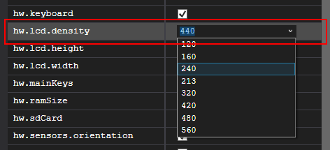

# Managing Virtual Devices with the Android Device Manager

This article explains how to use the Android Device Manager to create and configure Android Virtual Devices (AVDs) that emulate physical Android devices. You can use these virtual devices to run and test your app without having to rely on a physical device.

After you have verified that hardware acceleration is enabled (as described in [Hardware Acceleration for Emulator Performance](hardware-acceleration.md)), the next step is to use the _Android Device Manager_ (also referred to as the _Xamarin Android Device Manager_) to create virtual devices that you can use to test and debug your app.

::: zone pivot="windows"

## Android Device Manager on Windows

This article explains how to use the Android Device Manager to create, duplicate, customize, and launch Android virtual devices.

[](media/device-manager/win/01-devices-dialog.png#lightbox)

You use the Android Device Manager to create and configure _Android Virtual Devices_ (AVDs) that run in the [Android Emulator](~/android/deploy-test/debugging/debug-on-emulator.md). Each AVD is an emulator configuration that simulates a physical Android device. This makes it possible to run and test your app in a variety of configurations that simulate different physical Android devices.

## Requirements

To use the Android Device Manager, you will need the following items:

- Visual Studio 2019 Community, Professional, or Enterprise.

- OR Visual Studio 2017 version 15.8 or later is required. Visual Studio Community, Professional, and Enterprise editions are supported.

- Visual Studio Tools for Xamarin version 4.9 or later.

- The Android SDK must be installed (see [Setting up the Android SDK for Xamarin.Android](~/android/get-started/installation/android-sdk.md)). Be sure to install the Android SDK at its default location if it is not already installed: **C:\\Program Files (x86)\\Android\\android-sdk**.

- The following packages must be installed (via the [Android SDK Manager](~/android/get-started/installation/android-sdk.md)):
- 
  - **Android SDK Tools version 26.1.1** or later
  - **Android SDK Platform-Tools 27.0.1** or later
  - **Android SDK Build-Tools 27.0.3** or later
  - **Android Emulator 27.2.7** or later.

  These packages should be displayed with **Installed** status as seen in the following screenshot:

  [](media/device-manager/win/02-sdk-tools.png#lightbox)

## Launching the Device Manager

Launch the Android Device Manager from the **Tools** menu by clicking **Tools > Android > Android Device Manager**:

[](media/device-manager/win/03-tools-menu.png#lightbox)

If the following error dialog is presented on launch, see the [Troubleshooting](#troubleshooting) section for workaround instructions:


## Main Screen

When you first launch the Android Device Manager, it presents a screen that displays all currently-configured virtual devices. For each virtual device, the **Name**, **OS** (Android Version), **Processor**, **Memory** size, and screen **Resolution** are displayed:

[](media/device-manager/win/05-installed-list.png#lightbox)

When you select a device in the list, the **Start** button appears on the right. You can click the **Start** button to launch the emulator with this virtual device:

[](media/device-manager/win/06-start-button.png#lightbox)

After the emulator starts with the selected virtual device, the **Start** button changes to a **Stop** button that you can use to halt the emulator:

[](media/device-manager/win/07-stop-button.png#lightbox)

### New Device

To create a new device, click the **New** button (located in the upper right-hand area of the screen):

[](media/device-manager/win/08-new-button.png#lightbox)

Clicking **New** launches the **New Device** screen:

[](media/device-manager/win/09-new-device-editor.png#lightbox)

To configure a new device in the **New Device** screen, use the following steps:

1. Give the device a new name. In the following example, the new device is named **Pixel_API_27**:

   [](media/device-manager/win/10-device-name.png#lightbox)

2. Select a physical device to emulate by clicking the **Base Device** pull-down menu:

   [](media/device-manager/win/11-device-menu.png#lightbox)

3. Select a processor type for this virtual device by clicking the **Processor** pull-down menu. Selecting **x86** will provide the best performance because it enables the emulator to take advantage of [hardware acceleration](hardware-acceleration.md). The **x86_64** option will also make use of hardware acceleration, but it runs slightly slower than **x86** (**x86_64** is normally used for testing 64-bit apps):

   [](media/device-manager/win/12-processor-type-menu.png#lightbox)

4. Select the Android version (API level) by clicking the **OS** pull-down menu. For example, select **Oreo 8.1 - API 27** to create a virtual device for API level 27:

   [](media/device-manager/win/13-android-version-w158.png#lightbox)

   If you select an Android API level that has not yet been installed, the Device Manager will display **A new device will be downloaded** message at the bottom of the screen &ndash; it will download and install the necessary files as it creates the new virtual device:

   

5. If you want to include Google Play Services APIs in your virtual device, enable the **Google APIs** option. To include the Google Play Store app, enable the **Google Play Store** option:

   [](media/device-manager/win/15-google-play-services.png#lightbox)

   Note that Google Play Store images are available only for some base device types such as Pixel, Pixel 2, Nexus 5, and Nexus 5X.

6. Edit any properties that you need to modify. To make changes to properties, see [Editing Android Virtual Device Properties](device-properties.md).

7. Add any additional properties that you need to explicitly set. The **New Device** screen lists only the most commonly-modified properties, but you can click the **Add Property** pull-down menu (at the bottom) to add additional properties:

   [](media/device-manager/win/16-add-property-menu.png#lightbox)

    You can also define a custom property by selecting **Custom...** at manager//the top of the property list.

8. Click the **Create** button (lower right-hand corner) to create the new device:

   [](media/device-manager/win/17-create-button.png#lightbox)

9. You might get a **License Acceptance** screen. Click **Accept** if you agree to the license terms:

   [](media/device-manager/win/18-license-acceptance.png#lightbox)

10. The Android Device Manager adds the new device to the list of installed virtual devices while displaying a **Creating** progress indicator during device creation:

    [](media/device-manager/win/19-creating-the-device.png#lightbox)

11. When the creation process is complete, the new device is shown in the list of installed virtual devices with a **Start** button, ready to launch:

    [](media/device-manager/win/20-created-device.png#lightbox)

### Edit Device

To edit an existing virtual device, select the device and click the **Edit** button (located in the upper right-hand corner of the screen):

[](media/device-manager/win/21-edit-button.png#lightbox)

Clicking **Edit** launches the Device Editor for the selected virtual device:

[](media/device-manager/win/22-device-editor.png#lightbox)

The **Device Editor** screen lists the properties of the virtual device under the **Property** column, with the corresponding values of each property in the **Value** column. When you select a property, a detailed description of that property is displayed on the right.

To change a property, edit its value in the **Value** column. For example, in the following screenshot the `hw.lcd.density` property is being changed from **480** to **240**:

[](media/device-manager/win/23-device-editing.png#lightbox)

After you have made the necessary configuration changes, click the **Save** button. For more information about changing virtual device properties, see [Editing Android Virtual Device Properties](device-properties.md).

### Additional Options

Additional options for working with devices are available from the **Additional Options** (&hellip;) pull-down menu in the upper right-hand corner:

[](media/device-manager/win/24-overflow-menu.png#lightbox)

The additional options menu contains the following items:

- **Duplicate and Edit** &ndash; Duplicates the currently-selected device and opens it in the **New Device** screen with a different unique name. For example, selecting **Pixel_API_27** and clicking **Duplicate and Edit** appends a counter to the name:

  [](media/device-manager/win/25-dupe-and-edit.png#lightbox)

- **Reveal in Explorer** &ndash; Opens a Windows Explorer window in the folder that holds the files for the virtual device. For example, selecting **Pixel_API_27** and clicking **Reveal in Explorer** opens a window like the following example:

  [](media/device-manager/win/26-reveal-in-explorer.png#lightbox)

- **Factory Reset** &ndash; Resets the selected device to its default settings, erasing any user changes made to the internal state of the device while it was running (this also erases the current [Quick Boot](~/android/deploy-test/debugging/debug-on-emulator.md#quick-boot) snapshot, if any). This change does not alter modifications that you make to the virtual device during creation and editing. A dialog box will appear with the reminder that this reset cannot be undone. Click **Factory Reset** to confirm the reset:

  

- **Delete** &ndash; Permanently deletes the selected virtual device. A dialog box will appear with the reminder that deleting a device cannot be undone. Click **Delete** if you are certain that you want to delete the device.

  

::: zone-end
::: zone pivot="macos"

> [!NOTE]
> If you are using a Mac with an Apple chip, such as the M1, you will need to install the [Android Emulator for M1 preview from GitHub](https://github.com/google/android-emulator-m1-preview/releases).

## Android Device Manager on macOS

This article explains how to use the Android Device Manager to create, duplicate, customize, and launch Android virtual devices.

[](media/device-manager/mac/01-devices-dialog.png#lightbox)

You use the Android Device Manager to create and configure *Android Virtual Devices* (AVDs) that run in the [Android Emulator](~/android/deploy-test/debugging/debug-on-emulator.md). Each AVD is an emulator configuration that simulates a physical Android device. This makes it possible to run and test your app in a variety of configurations that simulate different physical Android devices.

## Requirements

To use the Android Device Manager, you will need the following items:

- Visual Studio for Mac 7.6 or later.

- The Android SDK must be installed (see [Setting up the Android SDK for Xamarin.Android](~/android/get-started/installation/android-sdk.md)).

- The following packages must be installed (via the [Android SDK Manager](~/android/get-started/installation/android-sdk.md)):

  - **SDK tools version 26.1.1** or later
  - **Android SDK Platform-Tools 28.0.1** or later 
  - **Android SDK Build-Tools 26.0.3** or later

  These packages should be displayed with **Installed** status as seen in the following screenshot:

  [](media/device-manager/mac/02-sdk-tools.png#lightbox)

## Launching the Device Manager

Launch the Android Device Manager by clicking **Tools > Device Manager**:

[](media/device-manager/mac/03-tools-menu.png#lightbox)

If the following error dialog is presented on launch, see the [Troubleshooting](#troubleshooting) section for workaround instructions:


## Main Screen

When you first launch the Android Device Manager, it presents a screen that displays all currently-configured virtual devices. For each virtual device, the **Name**, **OS** (Android Version), **Processor**, **Memory** size, and screen **Resolution** are displayed:

[](media/device-manager/mac/05-devices-list.png#lightbox)

When you select a device in the list, the **Play** button appears on the right. You can click the **Play** button to launch the emulator with this virtual device:

[](media/device-manager/mac/06-start-button.png#lightbox)

After the emulator starts with the selected virtual device, the **Play** button changes to a **Stop** button that you can use to halt the emulator:

[](media/device-manager/mac/07-stop-button.png#lightbox)

When you stop the emulator, you may get a prompt asking if you want to save the current state for the next quick boot:


Saving the current state will make the emulator boot faster when this virtual device is launched again. For more information about Quick Boot, see [Quick Boot](~/android/deploy-test/debugging/debug-on-emulator.md#quick-boot).

### New Device

To create a new device, click the **New Device** button (located in the upper left-hand area of the screen):

[](media/device-manager/mac/09-new-button.png#lightbox)

Clicking **New Device** launches the **New Device** screen:

[](media/device-manager/mac/10-new-device-editor.png#lightbox)

Use the following steps to configure a new device in the **New Device** screen:

1. Give the device a new name. In the following example, the new device is named **Pixel_API_27**:

   [](media/device-manager/mac/11-device-name-m76.png#lightbox)

2. Select a physical device to emulate by clicking the **Base Device** pull-down menu:

   [](media/device-manager/mac/12-device-menu-m76.png#lightbox)

3. Select a processor type for this virtual device by clicking the **Processor** pull-down menu. Selecting **x86** will provide the best performance because it enables the emulator to take advantage of [hardware acceleration](hardware-acceleration.md). The **x86_64** option will also make use of hardware acceleration, but it runs slightly slower than **x86** (**x86_64** is normally used for testing 64-bit apps):

   [](media/device-manager/mac/13-processor-type-menu-m76.png#lightbox)

4. Select the Android version (API level) by clicking the **OS** pull-down menu. For example, select **Oreo 8.1 - API 27** to create a virtual device for API level 27:

   [](media/device-manager/mac/14-android-screenshot-m76.png#lightbox)

   If you select an Android API level that has not yet been installed, the Device Manager will display **A new device will be downloaded** message at the bottom of the screen &ndash; it will download and install the necessary files as it creates the new virtual device:

   

5. If you want to include Google Play Services APIs in your virtual device, enable the **Google APIs** option. To include the Google Play Store app, enable the **Google Play Store** option:

   [](media/device-manager/mac/16-google-play-services-m76.png#lightbox)

   Note that Google Play Store images are available only for some base device types such as Pixel, Pixel 2, Nexus 5, and Nexus 5X.

6. Edit any properties that you need to modify. To make changes to properties, see [Editing Android Virtual Device Properties](device-properties.md).

7. Add any additional properties that you need to explicitly set. The **New Device** screen lists only the most commonly-modified properties, but you can click the **Add Property** pull-down menu (at the bottom) to add additional properties:

   [](media/device-manager/mac/17-add-property-menu-m76.png#lightbox)

   You can also define a custom property by clicking **Custom...** at the top of this property list.

8. Click the **Create** button (lower right-hand corner) to create the new device:

   

9. The Android Device Manager adds the new device to the list of installed virtual devices while displaying a **Creating** progress indicator during device creation:

   [](media/device-manager/mac/19-creating-the-device-m76.png#lightbox)

10. When the creation process is complete, the new device is shown in the list of installed virtual devices with a **Start** button, ready to launch:

    [](media/device-manager/mac/20-created-device-m76.png#lightbox)

### Edit Device

To edit an existing virtual device, select the **Additional Options** pull-down menu (gear icon) and select **Edit**:

[](media/device-manager/mac/21-edit-button-m76.png#lightbox)

Clicking **Edit** launches the Device Editor for the selected virtual device:

[](media/device-manager/mac/22-device-editor.png#lightbox)

The **Device Editor** screen lists the properties of the virtual device under the **Property** column, with the corresponding values of each property in the **Value** column. When you select a property, a detailed description of that property is displayed on the right.

To change a property, edit its value in the **Value** column. For example, in the following screenshot the `hw.lcd.density` property is being changed from **480** to **240**:

[](media/device-manager/mac/23-device-editing.png#lightbox)

After you have made the necessary configuration changes, click the **Save** button. For more information about changing virtual device properties, see [Editing Android Virtual Device Properties](device-properties.md).

### Additional Options

Additional options for working with a device are available from the pull-down menu located to the left of the **Play** button:

[](media/device-manager/mac/24-overflow-menu.png#lightbox)

The additional options menu contains the following items:

- **Edit** &ndash; Opens the currently-selected device in the device editor as described earlier.

- **Duplicate and Edit** &ndash; Duplicates the currently-selected device and opens it in the **New Device** screen with a different unique name. For example, selecting **Pixel 2 API 28** and clicking **Duplicate and Edit** appends a counter to the name:

  [](media/device-manager/mac/25-dupe-and-edit.png#lightbox)

- **Reveal in Finder** &ndash; Opens a macOS Finder window in the folder that holds the files for the virtual device. For example, selecting **Pixel 2 API 28** and clicking **Reveal in Finder** opens a window like the following example:

  [](media/device-manager/mac/26-reveal-in-finder.png#lightbox)

- **Factory Reset** &ndash; Resets the selected device to its default settings, erasing any user changes made to the internal state of the device while it was running (this also erases the current [Quick Boot](~/android/deploy-test/debugging/debug-on-emulator.md#quick-boot) snapshot, if any). This change does not alter modifications that you make to the virtual device during creation and editing. A dialog box will appear with the reminder that this reset cannot be undone. Click **Factory Reset** to confirm the reset.

  

- **Delete** &ndash; Permanently deletes the selected virtual device. A dialog box will appear with the reminder that deleting a device cannot be undone. Click **Delete** if you are certain that you want to delete the device.

  

-----

<a name="troubleshooting"></a>

## Troubleshooting

The following sections explain how to diagnose and work around problems that may occur when using the Android Device Manager to configure virtual devices.

<!-- markdownlint-disable MD001 -->

# [Visual Studio](#tab/windows)

### Android SDK in Non-Standard Location

Typically, the Android SDK is installed at the following location:

**C:\\Program Files (x86)\\Android\\android-sdk**

If the SDK is not installed at this location, you may get this error when you launch the Android Device Manager:


To work around this problem, use the following steps:

1. From the Windows desktop, navigate to **C:\\Users\\*username*\\AppData\\Roaming\\XamarinDeviceManager**:

   

2. Double-click to open one of the log files and locate the **Config file path**. For example:

   [](media/device-manager/win/31-config-file-path.png#lightbox)

3. Navigate to this location and double-click **user.config** to open it.

4. In **user.config**, locate the `<UserSettings>` element and add an **AndroidSdkPath** attribute to it. Set this attribute to the path where the Android SDK is installed on your computer and save the file. For example, `<UserSettings>` would look like the following if the Android SDK was installed at **C:\\Programs\\Android\\SDK**:

   ```xml
   <UserSettings SdkLibLastWriteTimeUtcTicks="636409365200000000" AndroidSdkPath="C:ProgramsAndroidSDK" />
   ```

After making this change to **user.config**, you should be able to launch the Android Device Manager.

### Wrong Version of Android SDK Tools

If Android SDK tools 26.1.1 or later is not installed, you may see this error dialog on launch:


If you see this error dialog, click **Open SDK Manager** to open the Android SDK Manager. In the Android SDK Manager, click the **Tools** tab and install the following packages:

- **Android SDK Tools 26.1.1** or later
- **Android SDK Platform-Tools 27.0.1** or later
- **Android SDK Build-Tools 27.0.3** or later

### Snapshot disables WiFi on Android Oreo

If you have an AVD configured for Android Oreo with simulated Wi-Fi access, restarting the AVD after a snapshot may cause Wi-Fi access to become disabled.

To work around this problem,

1. Select the AVD in the Android Device Manager.

2. From the additional options menu, click **Reveal in Explorer**.

3. Navigate to **snapshots > default_boot**.

4. Delete the **snapshot.pb** file:

   

5. Restart the AVD.

After these changes are made, the AVD will restart in a state that allows Wi-Fi to work again.

# [Visual Studio for Mac](#tab/macos)

### Wrong Version of Android SDK Tools

If Android SDK tools 26.1.1 or later is not installed, you may see this error dialog on launch:


If you see this error dialog, click **OK** to open the Android SDK Manager. In the Android SDK Manager, click the **Tools** tab and install the following packages:

- **Android SDK Tools 26.1.1** or later
- **Android SDK Platform-Tools 28.0.1** or later
- **Android SDK Build-Tools 26.0.3** or later

### Snapshot disables WiFi on Android Oreo

If you have an AVD configured for Android Oreo with simulated Wi-Fi access, restarting the AVD after a snapshot may cause Wi-Fi access to become disabled.

To work around this problem,

1. Select the AVD in the Android Device Manager.

2. From the additional options menu, click **Reveal in Finder**.

3. Navigate to **snapshots > default_boot**.

4. Delete the **snapshot.pb** file:

   [](media/device-manager/mac/30-delete-snapshot.png#lightbox)

5. Restart the AVD.

After these changes are made, the AVD will restart in a state that allows Wi-Fi to work again.

-----

### Generating a Bug Report

# [Visual Studio](#tab/windows)

If you find a problem with the Android Device Manager that cannot be resolved using the above troubleshooting tips, please file a bug report by right-clicking the title bar and selecting **Generate Bug Report**:

[](media/device-manager/win/34-bug-report.png#lightbox)

# [Visual Studio for Mac](#tab/macos)

If you find a problem with the Android Device Manager that cannot be resolved using the above troubleshooting tips, please file a bug report by clicking **Help > Report a Problem**:

[](media/device-manager/mac/31-bug-report.png#lightbox)

::: zone-end

## Summary

This guide introduced the Android Device Manager available in Visual Studio Tools for Xamarin and Visual Studio for Mac. It explained essential features such as starting and stopping the Android emulator, selecting an Android virtual device (AVD) to run, creating new virtual devices, and how to edit a virtual device. It explained how to edit profile hardware properties for further customization, and it provided troubleshooting tips for common problems.

## Related Links

- [Changes to the Android SDK Tooling](~/android/troubleshooting/sdk-cli-tooling-changes.md)
- [Debugging on the Android Emulator](~/android/deploy-test/debugging/debug-on-emulator.md)
- [SDK Tools Release Notes (Google)](https://developer.android.com/studio/releases/sdk-tools)
- [avdmanager](https://developer.android.com/studio/command-line/avdmanager.html)
- [sdkmanager](https://developer.android.com/studio/command-line/sdkmanager.html)

## Related Video

> [!Video https://channel9.msdn.com/Shows/XamarinShow/How-to-Create-and-Manage-Your-Own-Android-Emulators/player]

[!include[](~/essentials/includes/xamarin-show-essentials.md)]
