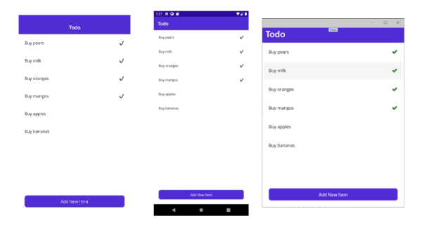

# .NET MAUI Local Databases

[ Browse the sample](/samples/dotnet/maui-samples/database-sqlite)

The SQLite database engine allows .NET MAUI applications to load and save data objects in shared code. The sample application uses a SQLite database table to store todo items. This article describes how to use the sqlite-net NuGet in shared code to store and retrieve information in a local database.

[](database-images/todo-list.png#lightbox "Todolist app on iOS, Android, and Windows")

Integrate SQLite.NET into mobile apps by following these steps:

1. [Install the NuGet package](#install-the-sqlite-nuget-package).
1. [Configure constants](#configure-app-constants).
1. [Create a database access class](#create-a-database-access-class).
1. [Access data](#access-data).
1. [Advanced configuration](#advanced-configuration).

## Install the SQLite NuGet package

Use the NuGet package manager to search for **sqlite-net-pcl** and add the latest version to the shared code project.

There are a number of NuGet packages with similar names. The correct package has these attributes:

- **ID:** sqlite-net-pcl
- **Authors:** SQLite-net
- **Owners:** praeclarum
- **NuGet link:** [sqlite-net-pcl](https://www.nuget.org/packages/sqlite-net-pcl/)

> [!NOTE]
> Despite the package name, use the **sqlite-net-pcl** NuGet package even in .NET MAUI, .NET 6, and .NET Standard projects.

### Install SQlitePCLRaw.bundle_green

In addition to **sqlite-net-pcl** we _temporarily_ need to install the underlying dependency that exposes SQLite on each platform.

- **ID:** SQLitePCLRaw.bundle_green
- **Version:** 2.1.2
- **Authors:** Eric Sink
- **Owners:** Eric Sink
- **NuGet link:** [SQLitePCLRaw.bundle_green](https://www.nuget.org/packages/SQLitePCLRaw.bundle_green/)

## Configure app constants

The sample project includes a **Constants.cs** file that provides common configuration data:

```csharp
public static class Constants
{
    public const string DatabaseFilename = "TodoSQLite.db3";

    public const SQLite.SQLiteOpenFlags Flags =
        // open the database in read/write mode
        SQLite.SQLiteOpenFlags.ReadWrite |
        // create the database if it doesn't exist
        SQLite.SQLiteOpenFlags.Create |
        // enable multi-threaded database access
        SQLite.SQLiteOpenFlags.SharedCache;

    public static string DatabasePath => 
        Path.Combine(FileSystem.AppDataDirectory, DatabaseFilename);
}
```

The constants file specifies default `SQLiteOpenFlag` enum values that are used to initialize the database connection. The `SQLiteOpenFlag` enum supports these values:

- `Create`: The connection will automatically create the database file if it doesn't exist.
- `FullMutex`: The connection is opened in serialized threading mode.
- `NoMutex`: The connection is opened in multi-threading mode.
- `PrivateCache`: The connection will not participate in the shared cache, even if it's enabled.
- `ReadWrite`: The connection can read and write data.
- `SharedCache`: The connection will participate in the shared cache, if it's enabled.
- `ProtectionComplete`: The file is encrypted and inaccessible while the device is locked.
- `ProtectionCompleteUnlessOpen`: The file is encrypted until it's opened but is then accessible even if the user locks the device.
- `ProtectionCompleteUntilFirstUserAuthentication`: The file is encrypted until after the user has booted and unlocked the device.
- `ProtectionNone`: The database file isn't encrypted.

You may need to specify different flags depending on how your database will be used. For more information about `SQLiteOpenFlags`, see [Opening A New Database Connection](https://www.sqlite.org/c3ref/open.html) on sqlite.org.

## Create a database access class

A database wrapper class abstracts the data access layer from the rest of the app. This class centralizes query logic and simplifies the management of database initialization, making it easier to refactor or expand data operations as the app grows. The Todo app defines a `TodoItemDatabase` class for this purpose.

### Lazy initialization

The `TodoItemDatabase` uses asynchronous lazy initialization to delay initialization of the database until it's first accessed with a simple `Init` method that gets called by each method i nthe class:

```csharp
public class TodoItemDatabase
{
    SQLiteAsyncConnection Database;

    public TodoItemDatabase()
    {
    }

    async Task Init()
    {
        if (Database is not null)
            return;

        Database = new SQLiteAsyncConnection(Constants.DatabasePath, Constants.Flags);
        var result = await Database.CreateTableAsync<TodoItem>();
    }

    //...
}
```

In order to start the database initialization, avoid blocking execution, and have the opportunity to catch exceptions, the sample application uses asynchronous lazy initalization, represented by the `AsyncLazy<T>` class:

```csharp
public class AsyncLazy<T>
{
    readonly Lazy<Task<T>> instance;

    public AsyncLazy(Func<T> factory)
    {
        instance = new Lazy<Task<T>>(() => Task.Run(factory));
    }

    public AsyncLazy(Func<Task<T>> factory)
    {
        instance = new Lazy<Task<T>>(() => Task.Run(factory));
    }

    public TaskAwaiter<T> GetAwaiter()
    {
        return instance.Value.GetAwaiter();
    }
}
```

The `AsyncLazy` class combines the `Lazy<T>` and `Task<T>` types to create a lazy-initialized task that represents the initialization of a resource. The factory delegate that's passed to the constructor can either be synchronous or asynchronous. Factory delegates will run on a thread pool thread, and will not be executed more than once (even when multiple threads attempt to start them simultaneously). When a factory delegate completes, the lazy-initialized value is available, and any methods awaiting the `AsyncLazy<T>` instance receive the value. For more information, see [AsyncLazy](https://devblogs.microsoft.com/pfxteam/asynclazyt/).

### Data manipulation methods

The `TodoItemDatabase` class includes methods for the four types of data manipulation: create, read, edit, and delete. The SQLite.NET library provides a simple Object Relational Map (ORM) that allows you to store and retrieve objects without writing SQL statements.

```csharp
public class TodoItemDatabase
{
    // ...
       public async Task<List<TodoItem>> GetItemsAsync()
    {
        await Init();
        return await Database.Table<TodoItem>().ToListAsync();
    }

    public async Task<List<TodoItem>> GetItemsNotDoneAsync()
    {
        await Init();
        return await Database.Table<TodoItem>().Where(t => t.Done).ToListAsync();
        
        // SQL queries are also possible
        //return await Database.QueryAsync<TodoItem>("SELECT * FROM [TodoItem] WHERE [Done] = 0");
    }

    public async Task<TodoItem> GetItemAsync(int id)
    {
        await Init();
        return await Database.Table<TodoItem>().Where(i => i.ID == id).FirstOrDefaultAsync();
    }

    public async Task<int> SaveItemAsync(TodoItem item)
    {
        await Init();
        if (item.ID != 0)
        {
            return await Database.UpdateAsync(item);
        }
        else
        {
            return await Database.InsertAsync(item);
        }
    }

    public async Task<int> DeleteItemAsync(TodoItem item)
    {
        await Init();
        return await Database.DeleteAsync(item);
    }
}
```

## Access data in .NET MAUI

The `TodoItemDatabase` class can be registered as a `Singleton` that can be used throughout the application if you are using dependency injection. For example you could register your pages and the databse:

```csharp
builder.Services.AddSingleton<TodoListPage>();
builder.Services.AddTransient<TodoItemPage>();

builder.Services.AddSingleton<TodoItemDatabase>();
```

Then it could be injected into each class' constructor and accessed:

```csharp
TodoItemDatabase database;
public TodoItemPage(TodoItemDatabase todoItemDatabase)
{
    InitializeComponent();
    database = todoItemDatabase;
}

async void OnSaveClicked(object sender, EventArgs e)
{
    if (string.IsNullOrWhiteSpace(Item.Name))
    {
        await DisplayAlert("Name Required", "Please enter a name for the todo item.", "OK");
        return;
    }

    await database.SaveItemAsync(Item);
    await Shell.Current.GoToAsync("..");
}
```

Or a new instance could be created:

```csharp
TodoItemDatabase database;
public TodoItemPage()
{
    InitializeComponent();
    database = new TodoItemDatabase();
}
```

## Advanced configuration

SQLite provides a robust API with more features than are covered in this article and the sample app. The following sections cover features that are important for scalability.

For more information, see [SQLite Documentation](https://www.sqlite.org/docs.html) on sqlite.org.

### Write-ahead logging

By default, SQLite uses a traditional rollback journal. A copy of the unchanged database content is written into a separate rollback file, then the changes are written directly to the database file. The COMMIT occurs when the rollback journal is deleted.

Write-Ahead Logging (WAL) writes changes into a separate WAL file first. In WAL mode, a COMMIT is a special record, appended to the WAL file, which allows multiple transactions to occur in a single WAL file. A WAL file is merged back into the database file in a special operation called a _checkpoint_.

WAL can be faster for local databases because readers and writers do not block each other, allowing read and write operations to be concurrent. However, WAL mode doesn't allow changes to the _page size_, adds additional file associations to the database, and adds the extra _checkpointing_ operation.

To enable WAL in SQLite.NET, call the `EnableWriteAheadLoggingAsync` method on the `SQLiteAsyncConnection` instance:

```csharp
await Database.EnableWriteAheadLoggingAsync();
```

For more information, see [SQLite Write-Ahead Logging](https://www.sqlite.org/wal.html) on sqlite.org.

### Copy a database

There are several cases where it may be necessary to copy a SQLite database:

- A database has shipped with your application but must be copied or moved to writeable storage on the mobile device.
- You need to make a backup or copy of the database.
- You need to version, move, or rename the database file.

In general, moving, renaming, or copying a database file is the same process as any other file type with a few additional considerations:

- All database connections should be closed before attempting to move the database file.
- If you use [Write-Ahead Logging](#write-ahead-logging), SQLite will create a Shared Memory Access (.shm) file and a (Write Ahead Log) (.wal) file. Ensure that you apply any changes to these files as well.

## Related links

- [Todo sample application](/samples/dotnet-maui/dotnet-maui-samples/todo)
- [SQLite.NET NuGet package](https://www.nuget.org/packages/sqlite-net-pcl/)
- [SQLite documentation](https://www.sqlite.org/docs.html)
