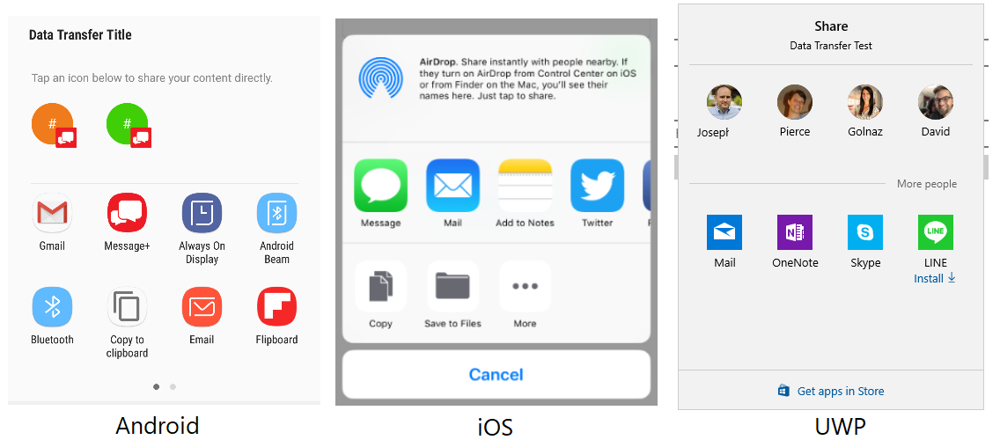

# Xamarin.Essentials: Share

The **Share** class enables an application to share data such as text and web links to other applications on the device.

## Get started

[!include[](~/essentials/includes/get-started.md)]

# [Android](#tab/android)

No additional setup required.

# [iOS](#tab/ios)

If your application shares media files, you must add the following keys to your `Info.plist`:

```xml
<key>NSPhotoLibraryAddUsageDescription</key>
<string>This app needs access to the photo gallery for saving photos and videos.</string>
<key>NSPhotoLibraryUsageDescription</key>
<string>This app needs access to photos gallery for saving photos and videos.</string>
```

Ensure that you update the `<string>` in each to a text that's specific for your app, because it will be shown to your users.

# [UWP](#tab/uwp)

No additional setup required.

-----

## Using Share

Add a reference to Xamarin.Essentials in your class:

```csharp
using Xamarin.Essentials;
```

The Share functionality works by calling the `RequestAsync` method with a data request payload that includes information to share to other applications. Text and Uri can be mixed and each platform will handle filtering based on content.

```csharp

public class ShareTest
{
    public async Task ShareText(string text)
    {
        await Share.RequestAsync(new ShareTextRequest
            {
                Text = text,
                Title = "Share Text"
            });
    }

    public async Task ShareUri(string uri)
    {
        await Share.RequestAsync(new ShareTextRequest
            {
                Uri = uri,
                Title = "Share Web Link"
            });
    }
}
```

User interface to share to external application that appears when request is made:



## File

This features enables an app to share files to other applications on the device. Xamarin.Essentials will automatically detect the file type (MIME) and request a share. Each platform may only support specific file extensions.

Here is a sample of writing text to disk and sharing it to other apps:

```csharp
var fn =  "Attachment.txt";
var file = Path.Combine(FileSystem.CacheDirectory, fn);
File.WriteAllText(file, "Hello World");

await Share.RequestAsync(new ShareFileRequest
{
    Title = Title,
    File = new ShareFile(file)
});
```

## Multiple Files

The usage of share multiple files differs from the single file only in the ability of sending several files at once:

```csharp
var file1 = Path.Combine(FileSystem.CacheDirectory, "Attachment1.txt");
File.WriteAllText(file, "Content 1");
var file2 = Path.Combine(FileSystem.CacheDirectory, "Attachment2.txt");
File.WriteAllText(file, "Content 2");

await Share.RequestAsync(new ShareMultipleFilesRequest
{
    Title = ShareFilesTitle,
    Files = new List<ShareFile> { new ShareFile(file1), new ShareFile(file2) }
});
```

## Presentation Location

[!include[](~/essentials/includes/ios-PresentationSourceBounds.md)]

## Platform Differences

# [Android](#tab/android)

- `Subject` property is used for desired subject of a message.

# [iOS](#tab/ios)

- `Subject` not used.

# [UWP](#tab/uwp)

- `Title` will default to Application Name if not set.
- `Subject` not used.

-----

## API

- [Share source code](https://github.com/xamarin/Essentials/tree/main/Xamarin.Essentials/Share)
- [Share API documentation](xref:Xamarin.Essentials.Share)

## Related Video

> [!Video https://channel9.msdn.com/Shows/XamarinShow/Share-Essential-API-of-the-Week/player]

[!include[](~/essentials/includes/xamarin-show-essentials.md)]
