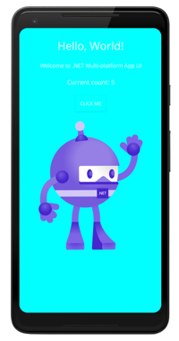

# Build your first .NET MAUI app

In this tutorial, you'll learn how to create and run your first .NET Multi-platform App UI (MAUI) app.

> [!NOTE]
> Visual Studio for Mac support will arrive in a future release.

::: zone pivot="windows"

## Prerequisites

- An environment that has been configured for .NET MAUI development, using the maui-check tool. For more information, see [Install .NET 6 Preview 5](installation.md#install-net-6-preview-5).
- Visual Studio 2019 (build 16.11 Preview 2 or greater) or Visual Studio 2022 (any edition), with the required workloads. For more information, see [Installation](installation.md).
- A configured Android emulator. For more information about creating an Android emulator, see [Android emulator setup](/xamarin/android/get-started/installation/android-emulator/).

## Get started with Visual Studio 2019

In this tutorial, you'll create your first .NET MAUI app in Visual Studio 2019, and run it on an Android emulator:

1. Launch Visual Studio 2019 build 16.11 (Preview 2 or greater), and in the start window click **Create a new project** to create a new project:

    :::image type="content" source="first-app-images/new-solution.png" alt-text="New solution":::

1. In the **Create a new project** window, select **MAUI** in the **Project type** drop-down, select the **.NET MAUI App** template, and click the **Next** button:

    :::image type="content" source="first-app-images/new-project.png" alt-text="Choose a template":::

1. In the **Configure your new project** window, name your project, choose a suitable location for it, and click the **Create** button:

    :::image type="content" source="first-app-images/configure-project.png" alt-text="Configure the project":::

    Wait for the project to be created, and its dependencies to be restored:

    :::image type="content" source="first-app-images/restored-dependencies.png" alt-text="Restored dependencies":::

1. In the Visual Studio toolbar, select the drop-down next to the **Start** button (the triangular button that resembles a Play button), select **Android Emulator**, and then select the emulator you'd like to deploy the app to:

    :::image type="content" source="first-app-images/select-android-emulator.png" alt-text="Select your Android emulator":::

1. In the Visual Studio toolbar, press the **Start** button to launch the app in your chosen Android emulator.

1. In the running app in the Android emulator, press the **CLICK ME** button several times and observe that the count of the number of button clicks is incremented.

    [](first-app-images/running-app-large.png#lightbox)

## Build and debug iOS apps

To build and debug .NET 6 iOS apps from Visual Studio 2019 you must manually install the .NET 6 SDK and iOS workloads on both Windows and macOS (your Mac build host).

If, while connecting Visual Studio to your Mac through Xamarin Mac Agent (XMA), you are prompted to install a different version of the SDK, you can ignore the prompt since it refers to a legacy version of XMA.

> [!NOTE]
> Visual Studio 2019 can only currently deploy .NET MAUI iOS apps to the iOS simulator, and not to physical devices.

::: zone-end
::: zone pivot="dotnet-cli"

## Prerequisites

- An environment that has been configured for .NET MAUI development, using the maui-check tool. For more information, see [Install .NET 6 Preview 5](installation.md#install-net-6-preview-5).
- A configured simulator or emulator for your chosen platform. For more information about creating an Android emulator, see [Android emulator setup](/xamarin/android/get-started/installation/android-emulator/).

## Get started with .NET command-line interface

In this tutorial, you'll create and run your first .NET MAUI app using the .NET command-line interface (CLI):

1. In the .NET CLI, create a new .NET MAUI app:

    ```dotnetcli
    dotnet new maui -n HelloMauiPreview
    ```

1. In the .NET CLI, change directory to the newly created project:

    ```dotnetcli
    cd HelloMauiPreview
    ```

1. In the .NET CLI, change directory to the single project and restore its dependencies:

    ```dotnetcli
    cd HelloMauiPreview
    dotnet restore
    ```

1. In the .NET CLI, build and launch the app on your chosen platform:

    ```dotnetcli
    dotnet build -t:Run -f net6.0-android
    dotnet build -t:Run -f net6.0-ios
    dotnet build -t:Run -f net6.0-maccatalyst
    ```

    > [!NOTE]
    > These commands will launch the app on the default platform device, if one can be found. On Android, it's recommended to start an emulator before building and launching your app.

## iOS simulator selection

It's possible to specify which simulator is launched and used for net6.0-ios by specifying the `_DeviceName` MSBuild property:

```dotnetcli
dotnet build -t:Run -f net6.0-ios -p:_DeviceName=:v2:udid=<UDID>
```

You can retrieve a list of possible unique device id (UDID) values by executing the `simctl list` command:

```console
/Applications/Xcode.app/Contents/Developer/usr/bin/simctl list
```

The default iOS simulator will be launched if you don't specify a UDID.

::: zone-end
