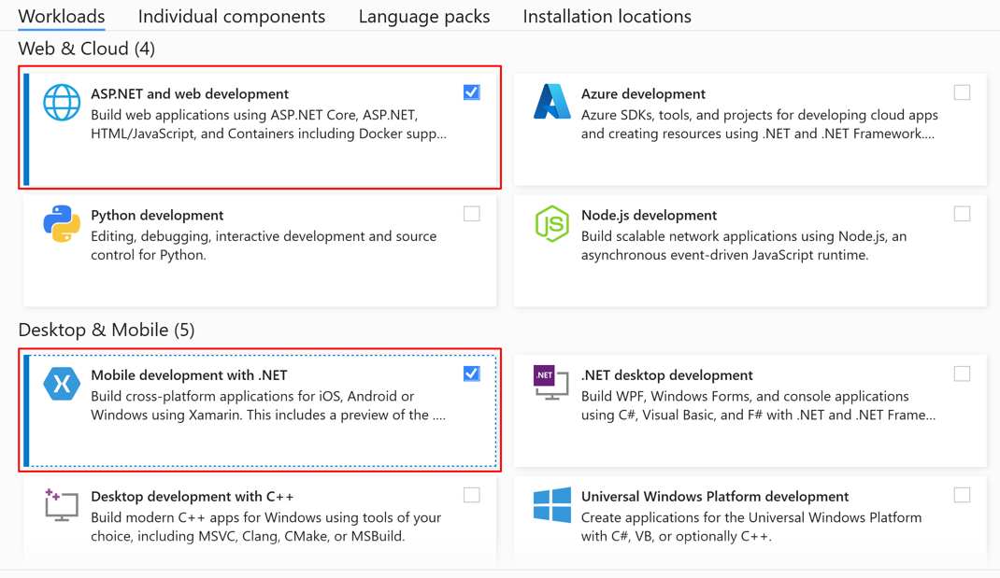

# .NET MAUI installation

> [!IMPORTANT]
> These requirements will change as new preview releases of Visual Studio and .NET MAUI are released.

To create .NET Multi-platform App UI (MAUI) apps, you currently require .NET 6 Preview 4 with .NET MAUI and the platform SDKs for Android, iOS, macOS, tvOS, and Mac Catalyst. You also need [Visual Studio 16.11 Preview 1](https://visualstudio.microsoft.com/vs/preview/) with the Mobile development with .NET and Universal Windows Platform development workloads installed:



To verify your development environment, and install any missing components, use the [maui-check](https://github.com/Redth/dotnet-maui-check) utility. Install this utility using the following .NET CLI command:

```dotnetcli
dotnet tool install -g redth.net.maui.check
```

Then, run `maui-check`:

```dotnetcli
maui-check
```

If any tools and SDKs required by .NET MAUI are missing, `maui-check` will install them. The example below shows the output generated if the tools and SDKs required by .NET MAUI are already installed:

```dotnetcli
      _   _   _____   _____     __  __      _      _   _   ___
     | \ | | | ____| |_   _|   |  \/  |    / \    | | | | |_ _|
     |  \| | |  _|     | |     | |\/| |   / _ \   | | | |  | |
  _  | |\  | | |___    | |     | |  | |  / ___ \  | |_| |  | |
 (_) |_| \_| |_____|   |_|     |_|  |_| /_/   \_\  \___/  |___|

☼ .NET MAUI Check ☼
────────────────────────────────────────────────────────────────────────────────────────────────────────────────────────
This tool will attempt to evaluate your .NET MAUI development environment.
If problems are detected, this tool may offer the option to try and fix them for you, or suggest a way to fix them
yourself.

Thanks for choosing .NET MAUI!
────────────────────────────────────────────────────────────────────────────────────────────────────────────────────────
» Synchronizing configuration... ok
» Scheduling appointments... ok

> OpenJDK 11.0 Checkup...
  - 11.0.10 (C:\Program Files\Microsoft\jdk-11.0.10.9-hotspot\bin\..)
  - 1.8.0-25 (C:\Program Files\Android\Jdk\microsoft_dist_openjdk_1.8.0.25)

> Visual Studio 16.10.0-pre.2.1 Checkup...
  - 16.11.0-pre.1.0 - C:\Program Files (x86)\Microsoft Visual Studio\2019\Preview
  - 16.10.0 - C:\Program Files (x86)\Microsoft Visual Studio\2019\Enterprise

> Android SDK Checkup...
  - emulator (30.1.5)
  - build-tools;30.0.2 (30.0.2)
  - platforms;android-30 (3)
  - system-images;android-30;google_apis_playstore;x86 (9)
  - platform-tools (30.0.4)

> Android Emulator Checkup...
  - Emulator: pixel_2_r_11_0_-_api_30 found.

> .NET SDK Checkup...
  - 3.1.115 - C:\Program Files\dotnet\sdk\3.1.115
  - 5.0.104 - C:\Program Files\dotnet\sdk\5.0.104
  - 5.0.300-preview.21258.4 - C:\Program Files\dotnet\sdk\5.0.300-preview.21258.4
  - 5.0.300 - C:\Program Files\dotnet\sdk\5.0.300
  - 6.0.100-preview.4.21255.9 - C:\Program Files\dotnet\sdk\6.0.100-preview.4.21255.9

> .NET SDK - EnableWorkloadResolver.sentinel Checkup...
  - C:\Program Files (x86)\Microsoft Visual
Studio\2019\Preview\MSBuild\Current\Bin\SdkResolvers\Microsoft.DotNet.MSBuildSdkResolver\EnableWorkloadResolver.sentinel
exists.
  - C:\Program Files (x86)\Microsoft Visual
Studio\2019\Enterprise\MSBuild\Current\Bin\SdkResolvers\Microsoft.DotNet.MSBuildSdkResolver\EnableWorkloadResolver.senti
nel exists.
  - C:\Program Files\dotnet\sdk\6.0.100-preview.4.21255.9\EnableWorkloadResolver.sentinel exists.

> .NET SDK - Workloads (6.0.100-preview.4.21255.9) Checkup...
  - microsoft-android-sdk-full (Microsoft.NET.Workload.Android : 11.0.200-preview.4.245) installed.
  - microsoft-ios-sdk-full (Microsoft.NET.Workload.iOS : 14.5.100-preview.4.638) installed.
  - microsoft-maccatalyst-sdk-full (Microsoft.NET.Workload.MacCatalyst : 14.5.100-preview.4.638) installed.
  - microsoft-tvos-sdk-full (Microsoft.NET.Workload.tvOS : 14.5.100-preview.4.638) installed.
  - microsoft-macos-sdk-full (Microsoft.NET.Workload.macOS : 11.3.100-preview.4.638) installed.

> .NET SDK - Packs (6.0.100-preview.4.21255.9) Checkup...
  - Microsoft.Maui.Templates (6.0.100-preview.4.634) installed.
  - Microsoft.iOS.Windows.Sdk (14.5.100-preview.4.638) installed.
  - Microsoft.Android.Sdk (11.0.200-preview.4.245) installed.
  - Microsoft.Android.Sdk.BundleTool (11.0.200-preview.4.245) installed.
  - Microsoft.Android.Ref (11.0.200-preview.4.245) installed.
  - Microsoft.Android.Templates (11.0.200-preview.4.245) installed.
  - Microsoft.iOS.Sdk (14.5.100-preview.4.638) installed.
  - Microsoft.iOS.Ref (14.5.100-preview.4.638) installed.
  - Microsoft.iOS.Templates (14.5.100-preview.4.638) installed.
  - Microsoft.MacCatalyst.Sdk (14.5.100-preview.4.638) installed.
  - Microsoft.MacCatalyst.Ref (14.5.100-preview.4.638) installed.
  - Microsoft.MacCatalyst.Templates (14.5.100-preview.4.638) installed.
  - Microsoft.tvOS.Sdk (14.5.100-preview.4.638) installed.
  - Microsoft.tvOS.Ref (14.5.100-preview.4.638) installed.
  - Microsoft.tvOS.Templates (14.5.100-preview.4.638) installed.
  - Microsoft.macOS.Sdk (11.3.100-preview.4.638) installed.
  - Microsoft.macOS.Ref (11.3.100-preview.4.638) installed.
  - Microsoft.macOS.Templates (11.3.100-preview.4.638) installed.
────────────────────────────────────────────────────────────────────────────────────────────────────────────────────────

- Congratulations, everything looks great!
```

## Build and launch apps

For instructions on how to create and build your first .NET MAUI app, see [Build your first .NET MAUI app](first-app.md).

Once a .NET MAUI app has been created, it can optionally be built using .NET CLI. The following .NET CLI commands show how to build and launch a .NET MAUI app on three different platforms:

```dotnetcli
dotnet build -t:Run -f net6.0-android
dotnet build -t:Run -f net6.0-ios
dotnet build -t:Run -f net6.0-maccatalyst
```

### iOS simulator selection

It's possible to specify which simulator is launched and used for net6.0-ios by specifying the `_DeviceName` MSBuild property:

```dotnetCLI
dotnet build -t:Run -f net6.0-ios -p:_DeviceName=:v2:udid=<UDID>
```

You can retrieve a list of possible unique device id (UDID) values by executing the `simctl list` command:

```console
/Applications/Xcode.app/Contents/Developer/usr/bin/simctl list
```

## IDE support

Currently, you should use the latest preview version of Visual Studio 2019 16.11 on Windows (with the Mobile development with .NET and Universal Windows Platform development workloads installed).

Visual Studio for Mac support will arrive in a future release.

### iOS from Visual Studio

To build and debug .NET 6 iOS apps from Visual Studio 2019 you must manually install the .NET 6 SDK and iOS workloads on both Windows and macOS (your Mac build host).

If, while connecting Visual Studio to your Mac through Xamarin Mac Agent (XMA), you are prompted to install a different version of the SDK, you can ignore the prompt since it refers to a legacy version of XMA.

> [!NOTE]
> Visual Studio 2019 can only currently deploy .NET MAUI iOS apps to the iOS simulator, and not to physical devices.

## Known issues

- There are no project property pages available for iOS and Android.
- Editors, such as the manifest editor and entitlements editor, will fail to open. As a workaround, files can be edited in the XML editor.
