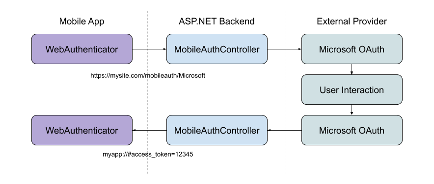

# Web Authenticator

This article describes how you can use the .NET Multi-platform App UI (.NET MAUI) Essentials the `WebAuthenticator` class. This class lets you start browser-based authentication flows, which listen for a callback to a specific URL registered to the app.

## Overview

Many apps require adding user authentication, and this often means enabling your users to sign in their existing Microsoft, Facebook, Google, or Apple Sign In account.

[Microsoft Authentication Library (MSAL)](/azure/active-directory/develop/msal-overview) provides an excellent turn-key solution to adding authentication to your app.

If you're interested in using your own web service for authentication, it's possible to use **WebAuthenticator** to implement the client-side functionality.

## Why use a server back end?

Many authentication providers have moved to only offering explicit or two-legged authentication flows to ensure better security. This means you'll need a **client secret** from the provider to complete the authentication flow. Unfortunately, mobile apps aren't a great place to store secrets and anything stored in a mobile app's code, binaries, or otherwise is considered to be insecure.

The best practice here's to use a web backend as a middle layer between your mobile app and the authentication provider.

> [!IMPORTANT]
> We strongly recommend against using older mobile-only authentication libraries and patterns which do not leverage a web backend in the authentication flow due to their inherent lack of security for storing client secrets.

## Get started

[!INCLUDE [get-started](includes/get-started.md)]

[!INCLUDE [essentials-namespace](includes/essentials-namespace.md)]

To access the **WebAuthenticator** functionality the following platform-specific setup is required.

<!-- markdownlint-disable MD025 -->
# [Android](#tab/android)

Android requires an **Intent Filter** setup to handle your callback URI. This is accomplished by inheriting from the `WebAuthenticatorCallbackActivity` class:

```csharp
using Android.App;
using Android.Content.PM;

namespace YourRootNamespace
{
    [Activity(NoHistory = true, LaunchMode = LaunchMode.SingleTop)]
    [IntentFilter(new[] { Android.Content.Intent.ActionView },
                  Categories = new[] { Android.Content.Intent.CategoryDefault, Android.Content.Intent.CategoryBrowsable },
                  DataScheme = CALLBACK_SCHEME)]
    public class WebAuthenticationCallbackActivity : Microsoft.Maui.Essentials.WebAuthenticatorCallbackActivity
    {
        const string CALLBACK_SCHEME = "myapp";

    }
}
```

If your project's target Android version is set to **Android 11 (R API 30)**, you must update your Android Manifest with queries that are used with the new [package visibility requirements](https://developer.android.com/preview/privacy/package-visibility).

Open the _AndroidManifest.xml_ file under the **Properties** folder and add the following in the `manifest` node:

```xml
<queries>
    <intent>
        <action android:name="android.support.customtabs.action.CustomTabsService" />
    </intent>
</queries>
```

# [iOS](#tab/ios)

Add your app's callback URI pattern to your _Info.plist_, such as:

```xml
<key>CFBundleURLTypes</key>
<array>
    <dict>
        <key>CFBundleURLName</key>
        <string>My App</string>
        <key>CFBundleURLSchemes</key>
        <array>
            <string>myapp</string>
        </array>
        <key>CFBundleTypeRole</key>
        <string>Editor</string>
    </dict>
</array>
```

You'll also need to override your `AppDelegate.OpenUrl` and `AppDelegate.ContinueUserActivity` methods in the `AppDelegate.cs` file to use the essentials call first:

```csharp
public override bool OpenUrl(UIApplication app, NSUrl url, NSDictionary options)
{
    if (Microsoft.Maui.Essentials.Platform.OpenUrl(app, url, options))
        return true;

    return base.OpenUrl(app, url, options);
}

public override bool ContinueUserActivity(UIApplication application, NSUserActivity userActivity, UIApplicationRestorationHandler completionHandler)
{
    if (Microsoft.Maui.Essentials.Platform.ContinueUserActivity(application, userActivity, completionHandler))
        return true;

    return base.ContinueUserActivity(application, userActivity, completionHandler);
}
```

# [Windows](#tab/windows)

For WinUI 3, you'll need to declare your callback URI protocol in your _Package.appxmanifest_ file:

```xml
<Applications>
    <Application Id="App" Executable="$targetnametoken$.exe" EntryPoint="MyApp.App">
        <Extensions>
            <uap:Extension Category="windows.protocol">
            <uap:Protocol Name="myapp">
                <uap:DisplayName>My App</uap:DisplayName>
            </uap:Protocol>
            </uap:Extension>
        </Extensions>
    </Application>
</Applications>
```

-----

## Using WebAuthenticator

The API consists mainly of a single method, `AuthenticateAsync`, which takes two parameters:

01. The url used to start the web browser flow.
01. The URI the flow is expected to ultimately call back to, that is registered to your app.

The result is a `WebAuthenticatorResult`, which includes any query parameters parsed from the callback URI:

```csharp
try
{
    WebAuthenticatorResult authResult = await WebAuthenticator.AuthenticateAsync(
        new Uri("https://mysite.com/mobileauth/Microsoft"),
        new Uri("myapp://"));

    string accessToken = authResult?.AccessToken;

    // Do something with the token
}
catch (TaskCanceledException e)
{
    // Use stopped auth
}
```

The `WebAuthenticator` API takes care of launching the url in the browser and waiting until the callback is received:



If the user cancels the flow at any point, a `TaskCanceledException` is thrown.

### Private authentication session

iOS 13 introduced an ephemeral web browser API for developers to launch the authentication session as private. This enables developers to request that no shared cookies or browsing data is available between authentication sessions and will be a fresh login session each time. This is available through the `WebAuthenticatorOptions` parameter passed to the `AuthenticateAsync` method:

```csharp
try
{
    WebAuthenticatorResult authResult = await WebAuthenticator.AuthenticateAsync(
        new WebAuthenticatorOptions()
        {
            Url = new Uri("https://mysite.com/mobileauth/Microsoft"),
            CallbackUrl = new Uri("myapp://"),
            PrefersEphemeralWebBrowserSession = true
        });

    string accessToken = authResult?.AccessToken;

    // Do something with the token
}
catch (TaskCanceledException e)
{
    // Use stopped auth
}
```

## Platform differences

This section describes the platform-specific differences with the web authentication API.

<!-- markdownlint-disable MD025 -->
<!-- markdownlint-disable MD024 -->
### [Android](#tab/android)

**Custom Tabs** are used whenever available, otherwise an **Intent** is started for the URL.

# [iOS](#tab/ios)

Depending on the iOS version, behavior is slightly different:

- iOS 12 or higher\
  `ASWebAuthenticationSession` is used.

- iOS 11\
  `SFAuthenticationSession` is used.

- Older iOS versions\
  `SFSafariViewController` is used if available, otherwise **Safari** is used.

# [Windows](#tab/windows)

On WinUI 3, the `WebAuthenticationBroker` is used, if supported, otherwise the system browser is used.

-----
<!-- markdownlint-enable MD024 -->
<!-- markdownlint-enable MD025 -->

## Apple Sign In

According to [Apple's review guidelines](https://developer.apple.com/app-store/review/guidelines/#sign-in-with-apple), if your app uses any social login service to authenticate, it must also offer Apple Sign In as an option.

To add Apple Sign In to your apps, first you'll need to [configure your app to use Apple Sign In](../ios/platform/ios13/sign-in.md).

For iOS 13 and higher, call the `AppleSignInAuthenticator.AuthenticateAsync()` method. This will use automatically the native Apple Sign in APIs so your users get the best experience possible on these devices. For example, You can write your shared code to use the right API at runtime:

```csharp
var scheme = "..."; // Apple, Microsoft, Google, Facebook, etc.
var authUrlRoot = "https://mysite.com/mobileauth/";
WebAuthenticatorResult result = null;

if (scheme.Equals("Apple")
    && DeviceInfo.Platform == DevicePlatform.iOS
    && DeviceInfo.Version.Major >= 13)
{
    // Use Native Apple Sign In API's
    result = await AppleSignInAuthenticator.AuthenticateAsync();
}
else
{
    // Web Authentication flow
    var authUrl = new Uri($"{authUrlRoot}{scheme}");
    var callbackUrl = new Uri("myapp://");

    result = await WebAuthenticator.AuthenticateAsync(authUrl, callbackUrl);
}

var authToken = string.Empty;

if (result.Properties.TryGetValue("name", out string name) && !string.IsNullOrEmpty(name))
    authToken += $"Name: {name}{Environment.NewLine}";

if (result.Properties.TryGetValue("email", out string email) && !string.IsNullOrEmpty(email))
    authToken += $"Email: {email}{Environment.NewLine}";

// Note that Apple Sign In has an IdToken and not an AccessToken
authToken += result?.AccessToken ?? result?.IdToken;
```

> [!TIP]
> For non-iOS 13 devices, this will start the web authentication flow, which can also be used to enable Apple Sign In on your Android and Windows devices.
> You can sign into your iCloud account on your iOS simulator to test Apple Sign In.

## ASP.NET core server back end

It's possible to use the `WebAuthenticator` API with any web back-end service. To use it with an ASP.NET core app, configure the web app with the following steps:

01. Set up your [external social authentication providers](/aspnet/core/security/authentication/social/?tabs=visual-studio) in an ASP.NET Core web app.
01. Set the **Default Authentication Scheme** to `CookieAuthenticationDefaults.AuthenticationScheme` in your `.AddAuthentication()` call.
01. Use `.AddCookie()` in your _Startup.cs_ `.AddAuthentication()` call.
01. All providers must be configured with `.SaveTokens = true;`.

```csharp
services.AddAuthentication(o =>
    {
        o.DefaultScheme = CookieAuthenticationDefaults.AuthenticationScheme;
    })
    .AddCookie()
    .AddFacebook(fb =>
    {
        fb.AppId = Configuration["FacebookAppId"];
        fb.AppSecret = Configuration["FacebookAppSecret"];
        fb.SaveTokens = true;
    });
```

> [!TIP]
> If you'd like to include Apple Sign In, you can use the `AspNet.Security.OAuth.Apple` NuGet package. You can view the full [Startup.cs sample](https://github.com/dotnet/maui/tree/main/src/Essentials/samples/Sample.Server.WebAuthenticator/Startup.cs#L33-L64) in the Essentials GitHub repository.

### Add a custom mobile auth controller

With a mobile authentication flow, you usually start the flow directly to a provider the user has chosen. For example, clicking a "Microsoft" button on the sign-in screen of the app. It's also important to return relevant information to your app at a specific callback URI to end the authentication flow.

To achieve this, use a custom API Controller:

```csharp
[Route("mobileauth")]
[ApiController]
public class AuthController : ControllerBase
{
    const string callbackScheme = "myapp";

    [HttpGet("{scheme}")] // eg: Microsoft, Facebook, Apple, etc
    public async Task Get([FromRoute]string scheme)
    {
        // 1. Initiate authentication flow with the scheme (provider)
        // 2. When the provider calls back to this URL
        //    a. Parse out the result
        //    b. Build the app callback URL
        //    c. Redirect back to the app
    }
}
```

The purpose of this controller is to infer the scheme (provider) the app is requesting, and start the authentication flow with the social provider. When the provider calls back to the web backend, the controller parses out the result and redirects to the app's callback URI with parameters.

Sometimes you may want to return data such as the provider's `access_token` back to the app, which you can do via the callback URI's query parameters. Or, you may want to instead create your own identity on your server and pass back your own token to the app. What and how you do this part is up to you!

Check out the [full controller sample](https://github.com/dotnet/maui/tree/main/src/Essentials/samples/Sample.Server.WebAuthenticator/Controllers/MobileAuthController.cs) in the Essentials repository.

> [!NOTE]
> The above sample demonstrates how to return the access token from the 3rd party authentication (ie: OAuth) provider. To obtain a token you can use to authorize web requests to the web backend itself, you should create your own token in your web app, and return that instead. The [Overview of ASP.NET Core authentication](/aspnet/core/security/authentication) has more information about advanced authentication scenarios in ASP.NET Core.

## API

- [WebAuthenticator source code](https://github.com/dotnet/maui/tree/main/src/Essentials/src/WebAuthenticator)
<!-- - [WebAuthenticator API documentation](xref:Microsoft.Maui.Essentials.WebAuthenticator)-->
- [ASP.NET Core Server Sample](https://github.com/dotnet/maui/tree/main/src/Essentials/samples/Sample.Server.WebAuthenticator)
