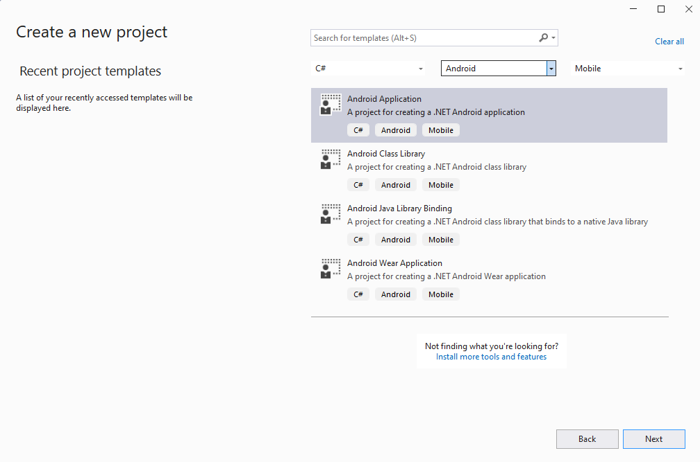
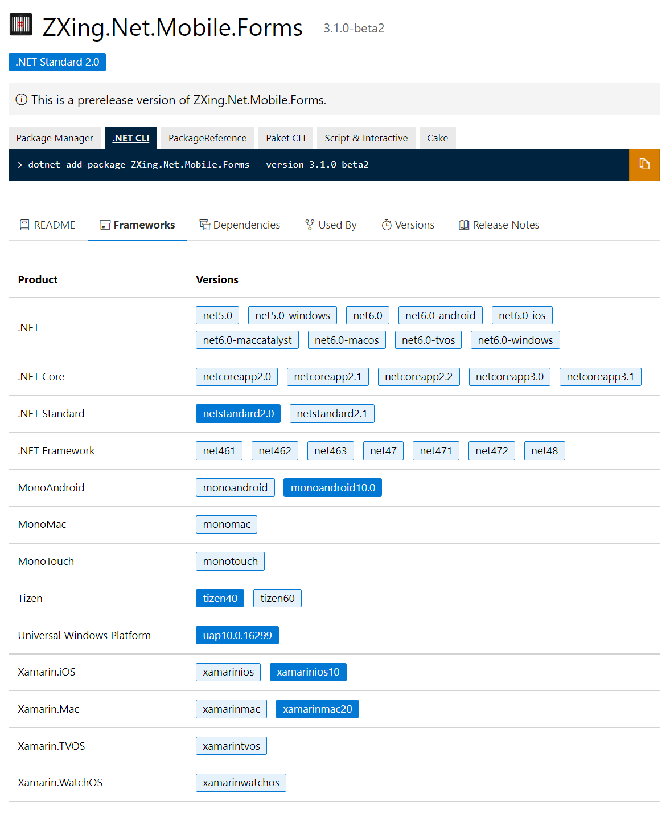
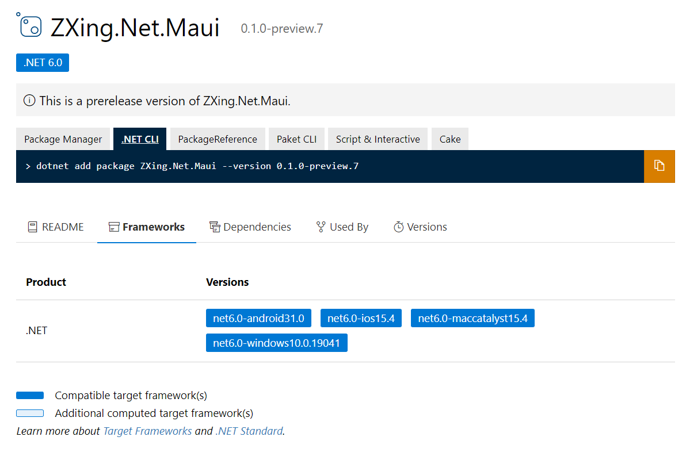

# Upgrading Xamarin.Android, Xamarin.iOS, and Xamarin.Mac

In order to upgrade your Xamarin.Android and Xamarin.iOS projects to .NET you will first update to the SDK Style project system (i.e. update your csproj) and then update your dependencies to .NET 6 or newer versions. For most applications, that’s the beginning and the end of the journey – compile and test your apps. You don’t need to change namespaces or rewrite these apps.

**Checklist:**

* Update your csproj to SDK Style
* Upgrade or replace incompatible dependencies with .NET 6 (or newer) versions
* Compile and test your app

To simplify the upgrade, we recommend creating a new .NET project of the same type and name as your Xamarin project, and then copying in your code. This is the approach we will describe below.

## Create new project

From Visual Studio 2022, create a new project. Select the platform project you are upgrading to. For example, to Upgrade from Xamarin.Android to .NET for Android select the "Android Application" project template.



Give the project the same project name and package name as your existing project, placing it in a new folder. Open the _csproj_ file to confirm you have a .NET SDK Style project.

```xml
<Project Sdk="Microsoft.NET.Sdk">
  <PropertyGroup>
    <TargetFramework>net6.0-android</TargetFramework>
    <SupportedOSPlatformVersion>21</SupportedOSPlatformVersion>
    <OutputType>Exe</OutputType>
    <Nullable>enable</Nullable>
    <ImplicitUsings>enable</ImplicitUsings>
    <ApplicationId>com.companyname.AndroidApp2</ApplicationId>
    <ApplicationVersion>1</ApplicationVersion>
    <ApplicationDisplayVersion>1.0</ApplicationDisplayVersion>
  </PropertyGroup>
</Project>
```

> The Target Framework Moniker (TFM) is what denotes the project as using .NET 6. Valid TFMs are net6.0-android, net6.0-ios, net6.0-maccatalyst, net6.0-macos, net6.0-tizen, and net6.0-windows.

Before continuing on, confirm your environment can build and run the new project by debugging (F5).

## Merge files

From File Explorer (Finder) copy your code and resource files into the same location within the new project folder. Overwrite any files of the same name.

If you have other library projects, you will want to import them into the new project solution and [add project references](https://learn.microsoft.com/visualstudio/ide/managing-references-in-a-project?view=vs-2022) to your new .NET project.

At some point in the process you'll want to copy over your project properties for settings like conditional compilation arguments and code signing. Opening the projects side-by-side in Visual Studio instances will allow you to compare the project properties dialogs. Alternatively, you can migrate the settings by editing the _csproj_ file directly.

* [Xamarin.Android csproj conversion](android-csproj.md)
* [Xamarin.iOS csproj conversion](ios-csproj.md)

## Update dependencies (NuGets)

Xamarin NuGets are not directly compatible with .NET 6 unless they have been recompiled using .NET TFMs. You can confirm a package is .NET 6 compatible by looking at the "Frameworks" tab on NuGet.org for the library you are using.

This library is NOT compatible since it doesn't have .NET TFMs for the platform we are using.



On the other hand, this library IS compatible with the .NET TFM we are using.



Some NuGets may include both .NET TFMs and Mono* or Xamarin.* frameworks. That's okay. As long as the NuGet includes the .NET TFMs you are targeting, the package is compatible.

Add compatible NuGets to your new project using the NuGet package manager in Visual Studio. What should you do about incompatible dependencies?

* if you own the code, recompile it with .NET TFMs
* look for a preview release that is .NET 6 compatible
* replace the dependencies with a .NET 6 compatible alternative

## Compile and troubleshoot

Once your dependencies are resolved and your files are in place, you are ready to compile the project. At this point, errors are your guide and will tell you want work (if any) you need to do next.

### See also

* [Xamarin.Android csproj conversion](android-csproj.md)
* [Xamarin.iOS csproj conversion](ios-csproj.md)
