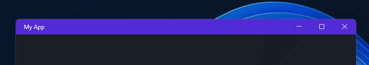
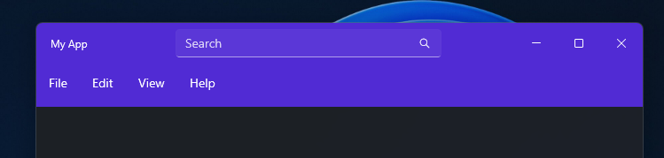

# Customize the title bar

The <xref:Microsoft.Maui.Controls.TitleBar> control makes it easy to create a customizable titlebar for your MAUI app with the following features:

* Configurable Icon, Title, and Subtitle properties
* Integrated shell buttons
* The ability to add a custom control like a search box
* Automatic hiding and showing of elements based on window width
* Affordances for showing active or deactive window state
* Support for default titlebar features including draggable regions in empty areas, theme responsiveness, default caption (min/max/close) buttons, and built-in accessibility support


## Create a default window

To customize the title bar in your application, you can simply add a <xref:Microsoft.Maui.Controls.TitleBar> control to a parent <xref:Microsoft.Maui.Controls.Window> object. However, .NET MAUI automatically handles the creation of the `Window` object, so we must first override how a new `Window` is created.

First, create a new file named _MainWindow.xaml_, which will inherit from the default `Window` class:
```xml
<?xml version="1.0" encoding="utf-8" ?>
<Window xmlns="http://schemas.microsoft.com/dotnet/2021/maui"
        xmlns:x="http://schemas.microsoft.com/winfx/2009/xaml"
        x:Class="TitlebarSample.MainWindow"
        Title="MainWindow">
</Window>
```

Then, modify _MainWindow.xaml.cs_:
```csharp
namespace TitlebarSample;

public partial class MainWindow : Window
{
    public MainWindow(Page page)
    {
        InitializeComponent();
        Page = page;
    }
}
```

Finally, modify _App.xaml.cs_ to return the newly created `MainWindow` object:
```csharp
public partial class App : Application
{
    public App()
    {
        InitializeComponent();
    }

    protected override Window CreateWindow(IActivationState? activationState)
    {
        return new MainWindow(new NavigationPage(new MainPage()));
    }
}
```

## Add a new title bar control

Next, set the <xref:Microsoft.Maui.Controls.Window.TitleBar> property to the `TitleBar` control:
```xml
<?xml version="1.0" encoding="utf-8" ?>
<Window xmlns="http://schemas.microsoft.com/dotnet/2021/maui"
        xmlns:x="http://schemas.microsoft.com/winfx/2009/xaml"
        x:Class="TitlebarSample.MainWindow"
        Title="MainWindow">
    <Window.TitleBar>
        <TitleBar
            Title="My App"
            BackgroundColor="#512BD4"/>
    </Window.TitleBar>
</Window>
```

Run your app, and you'll see the title bar is now purple with the title set to "My App":



## Interactive content

You can use the <xref:Microsoft.Maui.Controls.TitleBar.LeadingContent>,  <xref:Microsoft.Maui.Controls.TitleBar.Content>, and  <xref:Microsoft.Maui.Controls.TitleBar.TrailingContent> properties to display interactive controls in the title bar. Any content set in these properties will automatically recieve input while blocking the title bar drag behavior.

You can also set the height of the title bar to fit the added content.

For example, to add a search box and settings button you can utilize the <xref:Microsoft.Maui.Controls.TitleBar.Content> and <xref:Microsoft.Maui.Controls.TitleBar.TrailingContent> properties:


```xml
<TitleBar
    Title="My App"
    BackgroundColor="#512BD4"
    HeightRequest="48">
    <TitleBar.Content>
        <SearchBar
            Placeholder="Search"
            MaximumWidthRequest="300"
            HorizontalOptions="FillAndExpand"
            VerticalOptions="Center" />
    </TitleBar.Content>
    <TitleBar.TrailingContent>
        <ImageButton
            HeightRequest="36"
            WidthRequest="36"
            BorderWidth="0"
            Background="Transparent">
            <ImageButton.Source>
                <FontImageSource
                    Size="16"
                    Glyph="&#xE713;"
                    FontFamily="SegoeMDL2"/>
            </ImageButton.Source>
        </ImageButton>
    </TitleBar.TrailingContent>
</TitleBar>
```


## Match title bar and menu bar background color

When using <xref:Microsoft.Maui.Controls.TitleBar.menubaritem> you may want to match the title bar and menu bar background color:



To do this, modify the <xref:Microsoft.Maui.Controls.NavigationPage.BarBackgroundColor> property to match the color of the title bar:

```csharp
public partial class App : Application
{
    public App()
    {
        InitializeComponent();
    }

    protected override Window CreateWindow(IActivationState? activationState)
    {
        return new MainWindow(new NavigationPage(new MainPage())
        {
            BarBackgroundColor = Color.FromArgb("#512BD4")
        });
    }
}
```

## Override the default template

If the default components on the `TitleBar` control do not meet your needs, you can also override the default control template to fully customize the title bar behavior:

```xml
 <TitleBar.ControlTemplate>
    <ControlTemplate>
        <Grid
            Background="Orange">
        <Label
            Text="My App"
            TextColor="Black"
            HorizontalOptions="Start"
            VerticalOptions="Center"
            Margin="16,0,0,0"
            x:Name="Blah"/>
        <Label
            Text="Footer"
            TextColor="Black"
            HorizontalOptions="End"
            VerticalOptions="Center"
            Margin="0,0,100,0"/>
        </Grid>
    </ControlTemplate>
 </TitleBar.ControlTemplate>
```

> [!NOTE]
> When overriding the default control template, you must add the interactive elements to the <xref:Microsoft.Maui.Controls.TitleBar.PassthroughElements> property otherwise they will not recieve input.

### Title bar visual states

The `TitleBar` control has the `TitleBarTitleActive` and `TitleBarTitleInactive` states to indicate when the parent window is active or inactive.

The following XAML example shows how to define a visual state for the `TitleBarTitleActive` and `TitleBarTitleInactive` states:

```xml
<ContentPage.Resources>
    <Style TargetType="TitleBar">
        <Setter Property="VisualStateManager.VisualStateGroups">
            <VisualStateGroupList>
                <VisualStateGroup x:Name="TitleActiveStates">
                    <VisualState x:Name="TitleBarTitleActive">
                        <VisualState.Setters>
                            <Setter Property="BackgroundColor"
                                    Value="Green" />
                        </VisualState.Setters>
                    </VisualState>
                    <VisualState x:Name="TitleBarTitleInactive">
                        <VisualState.Setters>
                            <Setter Property="BackgroundColor"
                                    Value="Red" />
                        </VisualState.Setters>
                    </VisualState>
                </VisualStateGroup>
            </VisualStateGroupList>
        </Setter>
    </Style>
</ContentPage.Resources>
```
