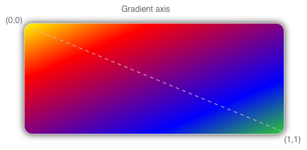

# .NET MAUI Paint: Linear gradients

The `LinearGradientPaint` class derives from the `GradientPaint` class, and paints an area with a linear gradient, which blends two or more colors along a line known as the gradient axis. `GradientStop` objects are used to specify the colors in the gradient and their positions. For more information about `GradientStop` objects, see [.NET MAUI Paint: Gradients](gradient.md).

The `LinearGradientPaint` class defines the following properties:

- `StartPoint`, of type `Point`, which represents the starting two-dimensional coordinates of the linear gradient. The class constructor initializes this property to (0,0).
- `EndPoint`, of type `Point`, which represents the ending two-dimensional coordinates of the linear gradient. The class constructor initializes this property to (1,1).

## Create a LinearGradientPaint object

A linear gradient's gradient stops are positioned along the gradient axis. The orientation and size of the gradient axis can be changed using the `StartPoint` and `EndPoint` properties. By manipulating these properties, you can create horizontal, vertical, and diagonal gradients, reverse the gradient direction, condense the gradient spread, and more.

The `StartPoint` and `EndPoint` properties are relative to the area being painted. (0,0) represents the top-left corner of the area being painted, and (1,1) represents the bottom-right corner of the area being painted. The following diagram shows the gradient axis for a diagonal linear gradient brush:



:::image type="content" source="lineargradient-images/gradient-axis.png" alt-text="The gradient axis for diagonal linear gradient.":::

In this diagram, the dashed line shows the gradient axis, which highlights the interpolation path of the gradient from the start point to the end point.

### Create a horizontal linear gradient

To create a horizontal linear gradient, create a `LinearGradientPaint` object and set its `StartColor` and `EndColor` properties. Then, set its `EndPoint` to (1,0).

The following example shows how to create a horizontal `LinearGradientPaint`:

```csharp
LinearGradientPaint linearGradientPaint = new LinearGradientPaint
{
    StartColor = Colors.Yellow,
    EndColor = Colors.Green,
    // StartPoint is already (0,0)
    EndPoint = new Point(1, 0)
};

RectangleF linearRectangle = new RectangleF(100, 100, 200, 100);
canvas.SetFillPaint(linearGradientPaint, linearRectangle);
canvas.SetShadow(new SizeF(10, 10), 10, Colors.Grey);
canvas.FillRoundedRectangle(linearRectangle, 12);
```

In this example, the rounded rectangle is painted with a linear gradient that interpolates horizontally from yellow to green:

:::image type="content" source="lineargradient-images/horizontal.png" alt-text="Screenshot of a rounded rectangle, filled with a horizontal linear gradient.":::

### Create a vertical linear gradient

To create a vertical linear gradient, create a `LinearGradientPaint` object and set its `StartColor` and `EndColor` properties. Then, set its `EndPoint` to (0,1).

The following example shows how to create a vertical `LinearGradientPaint`:

```csharp
LinearGradientPaint linearGradientPaint = new LinearGradientPaint
{
    StartColor = Colors.Yellow,
    EndColor = Colors.Green,
    // StartPoint is already (0,0)
    EndPoint = new Point(0, 1)
};

RectangleF linearRectangle = new RectangleF(100, 100, 200, 100);
canvas.SetFillPaint(linearGradientPaint, linearRectangle);
canvas.SetShadow(new SizeF(10, 10), 10, Colors.Grey);
canvas.FillRoundedRectangle(linearRectangle, 12);
```

In this example, the rounded rectangle is painted with a linear gradient that interpolates vertically from yellow to green:

:::image type="content" source="lineargradient-images/vertical.png" alt-text="Screenshot of a rounded rectangle, filled with a vertical linear gradient.":::

### Create a diagonal linear gradient

To create a diagonal linear gradient, create a `LinearGradientPaint` object and set its `StartColor` and `EndColor` properties.

The following example shows how to create a diagonal `LinearGradientPaint`:

```csharp
LinearGradientPaint linearGradientPaint = new LinearGradientPaint
{
    StartColor = Colors.Yellow,
    EndColor = Colors.Green,
    // StartPoint is already (0,0)
    // EndPoint is already (1,1)
};

RectangleF linearRectangle = new RectangleF(100, 100, 200, 100);
canvas.SetFillPaint(linearGradientPaint, linearRectangle);
canvas.SetShadow(new SizeF(10, 10), 10, Colors.Grey);
canvas.FillRoundedRectangle(linearRectangle, 12);
```

In this example, the rounded rectangle is painted with a linear gradient that interpolates diagonally from yellow to green:

:::image type="content" source="lineargradient-images/diagonal.png" alt-text="Screenshot of a rounded rectangle, filled with a diagonal linear gradient.":::
