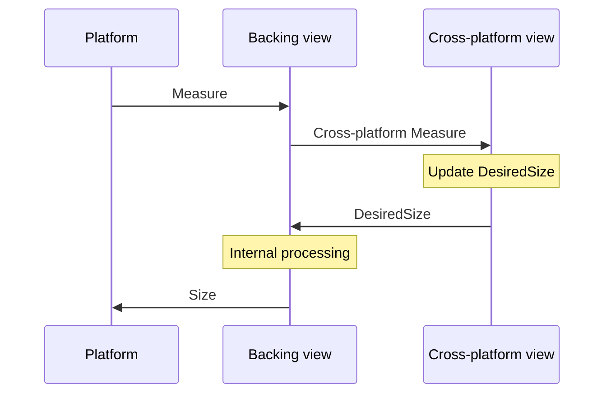

# Custom layouts

[ Browse the sample](/samples/dotnet/maui-samples/userinterface-customlayouts/)

A .NET Multi-platform App UI (.NET MAUI) layout is a list of views with rules and properties that define how to arrange those views within a container. Examples of layouts include <xref:Microsoft.Maui.Controls.Grid>, <xref:Microsoft.Maui.Controls.AbsoluteLayout>, and <xref:Microsoft.Maui.Controls.VerticalStackLayout>.

The process for creating a custom layout in .NET MAUI involves providing an <xref:Microsoft.Maui.Layouts.ILayoutManager> implementation, and overriding the <xref:Microsoft.Maui.Layouts.ILayoutManager.Measure%2A> and <xref:Microsoft.Maui.Layouts.ILayoutManager.ArrangeChildren%2A> methods. The <xref:Microsoft.Maui.Layouts.ILayoutManager.Measure%2A> implementation should call measure on each <xref:Microsoft.Maui.IView> in the layout, and should return the total size of the layout given the constraints. The <xref:Microsoft.Maui.Layouts.ILayoutManager.ArrangeChildren%2A> implementation should determine where each <xref:Microsoft.Maui.IView> should be placed within the given bounds, and should call <xref:Microsoft.Maui.IView.Arrange%2A> on each <xref:Microsoft.Maui.IView> with its appropriate bounds. The return value should be the actual size of the layout.

## Layout process

.NET MAUI's cross-platform layout process builds on top of the native layout process on each platform. Generally, all layout work is initiated by the native layout system. The cross-platform process runs when a layout or content backing control initiates it as a result of being measured or arraned by the native layout system.

The following diagram shows the process when the native layout system wants to measure a backing view:

In this example, assume that the cross-platform view being measured is a <xref:Microsoft.Maui.Controls.ContentView> that contains a <xref:Microsoft.Maui.Controls.Label>. A native platform, such as Android, needs to know the size of the <xref:Microsoft.Maui.Controls.ContentView>, given constraints of a width of 100 and a height of 200. The platform calls the <xref:Microsoft.Maui.Layouts.ILayoutManager.Measure%2A> method on the backing view for the <xref:Microsoft.Maui.Controls.ContentView> (which on Android is a `ContentViewGroup`) with the constraints. The backing view converts the constraints to cross-platform units, if required, and then calls its `CrossPlatformMeasure` method with those constraints to determine how large the <xref:Microsoft.Maui.Controls.Label> should be. The `CrossPlatformMeasure` method is responsible for calling the `Measure` method on the <xref:Microsoft.Maui.Controls.Label>. The <xref:Microsoft.Maui.Controls.Label> measures its native control, and updates its `DesiredSize` property based on that measurement. This value is return to the backing view as the results of the `CrossPlatformMeasure` method. The backing view then does whatever internal processing it needs to, and returns its measured size to the platform.

---

https://github.com/dotnet/maui/blob/main/docs/design/layout.md
https://learn.microsoft.com/en-us/xamarin/xamarin-forms/user-interface/layouts/custom
https://github.com/hartez/CustomLayoutExamples

This sample demonstrates the following custom layouts:

- CascadeLayout, which cascades items from top left to bottom right, similar to using the cascade windows arrangement in an MDI application.
- ColumnLayout, which is similar to the Xamarin.Forms *AndExpand properties. It's a subclass of VerticalStackLayout, which adds a Fill attached property that can be applied to one or more children of the layout. It uses a custom layout manager that converts the VerticalStackLayout into a single-column Grid at runtime. Each VerticalStackLayout child gets its own row in the Grid. The rows are set to a height of Auto, but children marked as Fill receive a row height of * instead.
- ContentColumnLayout, which is a custom layout that displays a header, content, and footer. It subclasses Layout and implements some extra properties and methods from the IGridLayout interface. This enables it to be passed into the GridLayoutManager to handle the layout at runtime.
- HorizontalWrapLayout, which works like a horizontal stack layout, except that instead of extending out as far as it needs to the right, it will wrap to a new row when it encounters the right edge of its container.
- ZStackLayout, which is a variation of a StackLayout that arranges its children on top of each other. All its children are laid out at the origin. The arrangement area's width is determined by the widest child and the height is determined by the tallest child.

In some situations you may find that you want to change the behavior of an existing layout type without having to create a custom layout. For those scenarios you can create an `ILayoutManagerFactory` and use it to replace the default layout manager type with your own. The `CustomizedGridLayoutManager` type in the sample demonstrates doing this:

- Write your own LayoutManager (e.g. CustomGridLayoutManager)
- Create an ILayoutManagerFactory (e.g. CustomLayoutManagerFactory)
- Register your factory with the app (e.g. MauiProgram)

When the app renders a `Grid` it will use your custom manager. In this example, the custom manager ensures that the `RowDefinitions` for the `Grid` includes enough rows to account for each `Grid.Row` property set in a child view.
