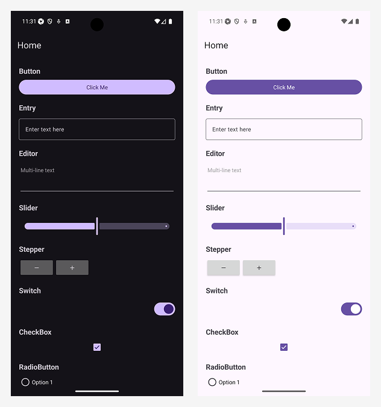

# What's new in .NET MAUI for .NET 11

The focus of .NET Multi-platform App UI (.NET MAUI) in .NET 11 is to improve product quality. For information about what's new in each .NET MAUI in .NET 11 release, see the following release notes:

- [.NET MAUI in .NET 11 Preview 1](https://github.com/dotnet/core/blob/main/release-notes/11.0/preview/preview1/dotnetmaui.md)
- [.NET MAUI in .NET 11 Preview 2](https://github.com/dotnet/core/blob/main/release-notes/11.0/preview/preview2/dotnetmaui.md)
- [.NET MAUI in .NET 11 Preview 3](https://github.com/dotnet/core/blob/main/release-notes/11.0/preview/preview3/dotnetmaui.md)
- [.NET MAUI in .NET 11 Preview 4](https://github.com/dotnet/core/blob/main/release-notes/11.0/preview/preview4/dotnetmaui.md)

> [!IMPORTANT]
> Due to working with external dependencies, such as Xcode or Android SDK Tools, the .NET MAUI support policy differs from the [.NET and .NET Core support policy](https://dotnet.microsoft.com/platform/support/policy/maui). For more information, see [.NET MAUI support policy](https://dotnet.microsoft.com/platform/support/policy/maui).

In .NET 11, .NET MAUI ships as a .NET workload and multiple NuGet packages. The advantage of this approach is that it enables you to easily pin your projects to specific versions, while also enabling you to easily preview unreleased or experimental builds.

## CoreCLR is the default runtime

:::moniker range=">=net-maui-11.0"

Starting in .NET 11 Preview 4, CoreCLR is the default runtime on all .NET MAUI platforms for projects built with and targeting .NET 11. This unifies the runtime across .NET MAUI with benefits for debugging, profiling, Hot Reload, app size, and app performance. For a detailed overview of this transition, see the [announcement blog post](https://aka.ms/maui-coreclr).

If you need to opt out of CoreCLR and use the Mono runtime instead, set `$(UseMonoRuntime)` to `true` in your project file:

```xml
<PropertyGroup>
  <UseMonoRuntime>true</UseMonoRuntime>
</PropertyGroup>
```

:::moniker-end

## `x:Code` directive for inline C# in XAML

:::moniker range=">=net-maui-11.0"

Starting in .NET 11 Preview 4, the XAML source generator supports an `x:Code` directive that lets you inline a small block of C# directly inside a XAML file. This makes it easier to keep view-local glue code next to the markup it serves without creating a code-behind partial just for a single helper. The `EnablePreviewFeatures` flag is required for this. For more information, see [GitHub PR #34715](https://github.com/dotnet/maui/pull/34715).

```xaml
<ContentPage xmlns="http://schemas.microsoft.com/dotnet/2021/maui"
             xmlns:x="http://schemas.microsoft.com/winfx/2009/xaml"
             x:Class="MyApp.MainPage">
    <x:Code><![CDATA[
        void OnButtonClicked(object sender, EventArgs e)
        {
            // inline C# method
        }
    ]]></x:Code>
    <Button Clicked="OnButtonClicked" Text="Click me" />
</ContentPage>
```

:::moniker-end

## Compiled bindings inside DataTemplates

:::moniker range=">=net-maui-11.0"

Starting in .NET 11 Preview 4, compiled bindings with explicit sources defined inside a <xref:Microsoft.Maui.Controls.DataTemplate> now resolve correctly, fixing a regression that broke <xref:Microsoft.Maui.Controls.TapGestureRecognizer> bindings inside <xref:Microsoft.Maui.Controls.CollectionView> items in .NET 10. For more information, see [GitHub PR #34447](https://github.com/dotnet/maui/pull/34447).

The XAML source generator now also:

- Emits diagnostics when an `x:DataType` or binding is invalid. For more information, see [GitHub PR #34078](https://github.com/dotnet/maui/pull/34078).
- Correctly distinguishes static extension classes from `enum` types when resolving XAML markup. For more information, see [GitHub PR #34446](https://github.com/dotnet/maui/pull/34446).

:::moniker-end

## Implicit XAML namespace declarations

:::moniker range=">=net-maui-11.0"

Starting in .NET 11, implicit XAML namespace declarations are enabled by default. XAML files no longer need the standard `xmlns` and `xmlns:x` declarations at the root element — the compiler injects them automatically. Existing explicit declarations still compile and can be used to disambiguate duplicate type names. For more information, see [GitHub PR #33834](https://github.com/dotnet/maui/pull/33834).

:::moniker-end

## Lazy ResourceDictionary

:::moniker range=">=net-maui-11.0"

XAML Source Generation now registers resource dictionary entries as factories, inflating each resource on demand instead of eagerly loading everything at startup. This can yield up to an ~8× improvement in resource dictionary initialization time for apps with large dictionaries. The optimization is automatic when XAML source generation is enabled — no code changes are required. For more information, see [GitHub PR #33826](https://github.com/dotnet/maui/pull/33826).

:::moniker-end

## InvalidateStyle and InvalidateVisualStates

:::moniker range=">=net-maui-11.0"

Two new APIs make it easier to reapply styles and visual states that have been mutated in place:

- `VisualElement.InvalidateStyle()` — forces a control to reapply its current <xref:Microsoft.Maui.Controls.Style>, picking up any property changes made directly on the style object.
- `VisualStateManager.InvalidateVisualStates(VisualElement)` — reapplies the current visual state group setters, useful when visual state property values change at runtime.

These methods are especially useful for Hot Reload scenarios and dynamic UI updates where styles or visual states are modified without replacing the entire style object. For more information, see [GitHub PR #34723](https://github.com/dotnet/maui/pull/34723).

```csharp
// Mutate a style in place and force the control to pick up the change
var style = myButton.Style;
style.Setters.Add(new Setter { Property = Button.BackgroundColorProperty, Value = Colors.Red });
myButton.InvalidateStyle();

// Reapply visual states after changing a setter value
VisualStateManager.InvalidateVisualStates(myButton);
```

:::moniker-end

## Trimmable CSS

:::moniker range=">=net-maui-11.0"

.NET MAUI CSS support is now fully trimmable. If your app doesn't use CSS stylesheets, the CSS infrastructure is trimmed away during publish, reducing app size. No code changes are needed — the linker removes unused CSS types automatically. For more information, see [GitHub PR #33160](https://github.com/dotnet/maui/pull/33160).

:::moniker-end

## Controls

.NET MAUI in .NET 11 includes control enhancements and deprecations.

### Material 3 on Android

:::moniker range=">=net-maui-11.0"

In .NET 11 Preview 4, the Android handlers for several core controls use Material 3 styling and behaviors out of the box, bringing them in line with modern Android design and unlocking the Material 3 theming system:

- <xref:Microsoft.Maui.Controls.ImageButton> — see [GitHub PR #33649](https://github.com/dotnet/maui/pull/33649).
- <xref:Microsoft.Maui.Controls.DatePicker> — see [GitHub PR #33651](https://github.com/dotnet/maui/pull/33651).
- <xref:Microsoft.Maui.Controls.Entry> — see [GitHub PR #33673](https://github.com/dotnet/maui/pull/33673).
- <xref:Microsoft.Maui.Controls.Slider> — see [GitHub PR #33603](https://github.com/dotnet/maui/pull/33603).



:::moniker-end

### BoxView Fill property

:::moniker range=">=net-maui-11.0"

<xref:Microsoft.Maui.Controls.BoxView> now exposes a `Fill` bindable property of type <xref:Microsoft.Maui.Controls.Brush>, allowing it to be painted with any brush (including <xref:Microsoft.Maui.Controls.LinearGradientBrush> and <xref:Microsoft.Maui.Controls.RadialGradientBrush>) instead of just a solid color. When both `Fill` and `Color` are set, `Fill` takes priority; setting `Fill` back to `null` causes the <xref:Microsoft.Maui.Controls.BoxView> to render using `Color` again. For more information, see [Fill a BoxView with a brush](~/user-interface/controls/boxview.md#fill-a-boxview-with-a-brush) and [GitHub PR #31789](https://github.com/dotnet/maui/pull/31789).

```xaml
<BoxView Opacity="0.5"
         WidthRequest="200"
         HeightRequest="100"
         HasShadow="true"
         HorizontalOptions="Center"
         VerticalOptions="Center">
    <BoxView.Fill>
        <LinearGradientBrush StartPoint="0,0" EndPoint="1,0">
            <GradientStop Color="Purple" Offset="0.0" />
            <GradientStop Color="Orange" Offset="0.5" />
            <GradientStop Color="Red" Offset="1.0" />
        </LinearGradientBrush>
    </BoxView.Fill>
</BoxView>
```

:::image type="content" source="../user-interface/controls/media/boxview/boxview-linear-fill.png" alt-text="Screenshot of a BoxView painted with a linear gradient brush.":::

Or a <xref:Microsoft.Maui.Controls.RadialGradientBrush>:

```xaml
<BoxView Opacity="0.5"
         WidthRequest="200"
         HeightRequest="100"
         HasShadow="true"
         HorizontalOptions="Center"
         VerticalOptions="Center">
    <BoxView.Fill>
        <RadialGradientBrush Center="0.5,0.5" Radius="0.5">
            <GradientStop Color="Yellow" Offset="0.0" />
            <GradientStop Color="Green" Offset="1.0" />
        </RadialGradientBrush>
    </BoxView.Fill>
</BoxView>
```

:::image type="content" source="../user-interface/controls/media/boxview/boxview-radial-fill.png" alt-text="Screenshot of a BoxView painted with a radial gradient brush.":::

:::moniker-end

### LongPressGestureRecognizer

:::moniker range=">=net-maui-11.0"

.NET 11 adds a built-in <xref:Microsoft.Maui.Controls.LongPressGestureRecognizer> for handling long-press gestures. It supports a configurable press duration, a movement threshold to cancel the gesture if the user's finger moves too far, state tracking via `GestureState`, and command binding with `Command` and `CommandParameter`. For more information, see [GitHub PR #33432](https://github.com/dotnet/maui/pull/33432).

```xaml
<Image Source="dotnet_bot.png">
    <Image.GestureRecognizers>
        <LongPressGestureRecognizer Duration="500"
                                    LongPressed="OnLongPressed" />
    </Image.GestureRecognizers>
</Image>
```

```csharp
void OnLongPressed(object sender, LongPressGestureRecognizerEventArgs e)
{
    if (e.State == GestureState.Completed)
    {
        // Handle completed long press
    }
}
```

:::moniker-end

### Map

:::moniker range=">=net-maui-11.0"

The <xref:Microsoft.Maui.Controls.Maps.Map> control receives a significant set of enhancements in .NET 11 Preview 3:

#### Pin clustering

Enable pin clustering to group nearby pins at lower zoom levels. Set `IsClusteringEnabled` on the map and optionally assign a `ClusteringIdentifier` to each pin. Handle the `ClusterClicked` event to respond when a user taps a cluster.

```xaml
<maps:Map IsClusteringEnabled="True"
          ClusterClicked="OnClusterClicked" />
```

#### Custom pin icons

Pins can now display a custom image instead of the default marker by setting the `ImageSource` property:

```csharp
var pin = new Pin
{
    Label = "Custom pin",
    Location = new Location(47.6062, -122.3321),
    ImageSource = ImageSource.FromFile("custom_pin.png")
};
```

#### Custom JSON map styling (Android)

Apply a custom JSON style to the map on Android using the `MapStyle` property. This enables dark mode maps, hiding labels, or any styling supported by the Google Maps Styling API.

#### Map events and element properties

- `MapLongClicked` — fires when the user long-presses on the map.
- `Circle`, `Polygon`, and `Polyline` now raise click events (`MapElementClick`).
- `MapElement.IsVisible` and `MapElement.ZIndex` — control element visibility and draw order.
- `Pin.ShowInfoWindow()` / `Pin.HideInfoWindow()` — programmatically show or hide a pin's info window.
- `UserLocationChanged` event and `LastUserLocation` property — track the user's location in real time.

#### Animated MoveToRegion and MapSpan.FromLocations

`MoveToRegion` now supports animated transitions, and the new `MapSpan.FromLocations()` factory method creates a span that encompasses a collection of locations.

For more information, see GitHub PRs [#29101](https://github.com/dotnet/maui/pull/29101), [#33831](https://github.com/dotnet/maui/pull/33831), [#33950](https://github.com/dotnet/maui/pull/33950), [#33982](https://github.com/dotnet/maui/pull/33982), [#33985](https://github.com/dotnet/maui/pull/33985), [#33792](https://github.com/dotnet/maui/pull/33792), [#33799](https://github.com/dotnet/maui/pull/33799), [#33991](https://github.com/dotnet/maui/pull/33991), and [#33993](https://github.com/dotnet/maui/pull/33993).

:::moniker-end

## Platform features

.NET MAUI's platform features have received some updates in .NET 11.

### MonochromeFile for Android adaptive icons

:::moniker range=">=net-maui-11.0"

Starting in .NET 11 Preview 4, single-project app icons can declare a dedicated monochrome layer for Android themed icons via a new `MonochromeFile` attribute on `MauiIcon`. This lets your themed icon use a different glyph than the foreground layer, instead of being a tinted reuse of it. For more information, see [GitHub PR #34569](https://github.com/dotnet/maui/pull/34569).

:::moniker-end

### iOS PostNotifications permission

:::moniker range=">=net-maui-11.0"

`Permissions.PostNotifications` is now implemented on iOS, providing a cross-platform API for requesting notification authorization. Previously this permission was only functional on Android. Use it to request authorization before scheduling local notifications on iOS. For more information, see [GitHub PR #30132](https://github.com/dotnet/maui/pull/30132).

```csharp
var status = await Permissions.RequestAsync<Permissions.PostNotifications>();
if (status == PermissionStatus.Granted)
{
    // Schedule notifications
}
```

:::moniker-end

## .NET for Android

.NET for Android in .NET 11 makes CoreCLR the default runtime for `Release` builds, and includes work to improve performance. For more information about .NET for Android in .NET 11, see the following release notes:

- [.NET for Android 11 Preview 1](https://github.com/dotnet/android/releases/)
- [.NET for Android 11 Preview 3](https://github.com/dotnet/android/releases/)

### Minimum supported Android API

Starting in .NET 11 Preview 3, the minimum supported Android API level has been raised from 21 (Lollipop) to 24 (Nougat). This means that .NET MAUI apps in .NET 11 require Android 7.0 or higher.

If your project explicitly sets `$(SupportedOSPlatformVersion)` to a value lower than 24, you'll need to update it:

```xml
<PropertyGroup>
  <SupportedOSPlatformVersion Condition="$([MSBuild]::GetTargetPlatformIdentifier('$(TargetFramework)')) == 'android'">24</SupportedOSPlatformVersion>
</PropertyGroup>
```

For more information, see [Supported platforms](~/supported-platforms.md).

> [!NOTE]
> Android API levels 21, 22, and 23 are only supported when using the Mono runtime. If you need to temporarily target API 21 while migrating your app, you can opt out of CoreCLR and revert `$(SupportedOSPlatformVersion)`:
>
> ```xml
> <PropertyGroup>
>   <UseMonoRuntime>true</UseMonoRuntime>
>   <SupportedOSPlatformVersion Condition="$([MSBuild]::GetTargetPlatformIdentifier('$(TargetFramework)')) == 'android'">21</SupportedOSPlatformVersion>
> </PropertyGroup>
> ```
>
> This is a temporary workaround. Plan to migrate to API 24 and CoreCLR for the final .NET 11 release.

## CoreCLR by Default

CoreCLR is now the default runtime for `Release` builds. This should
improve compatibility with the rest of .NET as well as shorter startup
times, with a reasonable increase to application size.

We are always working to improve performance and app size, but please
file issues with stability or concerns by filing
[issues on GitHub](https://github.com/dotnet/android/issues).

If you would like to opt out of CoreCLR, and use the Mono runtime
instead, you can still do so via:

```xml
<PropertyGroup>
  <UseMonoRuntime>true</UseMonoRuntime>
</PropertyGroup>
```

## `dotnet run`

We have enhanced the .NET CLI with [Spectre.Console](https://spectreconsole.net/) to *prompt* when a selection is needed for `dotnet run`.

So, for multi-targeted projects like .NET MAUI, it will:

* Prompt for a `$(TargetFramework)`
* Prompt for a device, emulator, simulator if there are more than one.

Console output of your application should appear directly in the terminal, and Ctrl+C will terminate the application.


## `dotnet watch` for Android

:::moniker range=">=net-maui-11.0"

Starting in .NET 11 Preview 4, `dotnet watch` works for Android devices and emulators. After selecting a target framework and device, `dotnet watch` deploys your app and applies Hot Reload changes as you edit — no manual rebuild required.


:::moniker-end

## `dotnet watch` for iOS

:::moniker range=">=net-maui-11.0"

Starting in .NET 11 Preview 4, several long-standing issues have been fixed to make `dotnet watch` usable end-to-end on a `dotnet new maui` project running in the iOS Simulator:

- The Spectre.Console TFM picker no longer appears stuck because two readers were both calling `Console.ReadKey()`. Keys now flow through a single `PhysicalConsole.KeyPressed` event. For more information, see [dotnet/sdk #53675](https://github.com/dotnet/sdk/pull/53675).
- <kbd>Ctrl+C</kbd> and <kbd>Ctrl+R</kbd> no longer surface a spurious `WebSocketException`/`ObjectDisposedException` when the WebSocket transport tears down. For more information, see [dotnet/sdk #53648](https://github.com/dotnet/sdk/pull/53648).
- Hot Reload no longer deadlocks on iOS when `UIKitSynchronizationContext` is installed before the startup hook runs. For more information, see [dotnet/sdk #54023](https://github.com/dotnet/sdk/pull/54023).


> [!IMPORTANT]
> `dotnet watch` does not work for iOS projects unless `<MtouchLink>None</MtouchLink>` is set in the `.csproj` file. For more information, see [dotnet/macios #25295](https://github.com/dotnet/macios/issues/25295).
>
> Add the following to your project file:
>
> ```xml
> <PropertyGroup>
>   <MtouchLink>None</MtouchLink>
> </PropertyGroup>
> ```

:::moniker-end

## .NET for iOS

.NET 11 on iOS, tvOS, Mac Catalyst, and macOS supports the following platform versions:

- iOS: 18.2
- tvOS: 18.2
- Mac Catalyst: 18.2
- macOS: 15.2

For more information about .NET 11 on iOS, tvOS, Mac Catalyst, and macOS, see the following release notes:

- [.NET 11.0.1xx Preview 1](https://github.com/dotnet/macios/releases/)

For information about known issues, see [Known issues in .NET 11](https://github.com/dotnet/macios/wiki/Known-issues-in-.NET11).

### Xcode 26.4

:::moniker range=">=net-maui-11.0"

Starting in .NET 11 Preview 4, Xcode 26.4 Stable is the supported Xcode version, with refreshed bindings across UIKit, AVFoundation, WebKit, Metal, Photos, PassKit, CarPlay, AuthenticationServices, and more. For more information, see [dotnet/macios #25005](https://github.com/dotnet/macios/pull/25005).

One Apple-side breaking change: `HMError.QuotaExceeded` was removed by Apple and is no longer available. For more information, see [dotnet/macios #25024](https://github.com/dotnet/macios/pull/25024).

:::moniker-end

### HTTP digest authentication

:::moniker range=">=net-maui-11.0"

Starting in .NET 11 Preview 4, HTTP digest authentication is supported in <xref:Foundation.NSUrlSessionHandler>. For more information, see [dotnet/macios #25180](https://github.com/dotnet/macios/pull/25180).

:::moniker-end

### CoreCLR for Apple platforms

:::moniker range=">=net-maui-11.0"

Starting in .NET 11 Preview 4, CoreCLR is the default runtime for .NET for iOS, Mac Catalyst, macOS, and tvOS. For more information, see [CoreCLR is the default runtime](#coreclr-is-the-default-runtime) and [dotnet/macios #25050](https://github.com/dotnet/macios/pull/25050).

Preview 4 also includes a broad reliability and packaging pass across `NSUrlSessionHandler`, MSBuild, the linker, and runtime internals. For the complete list of changes, see the [Preview 4 changelog](https://github.com/dotnet/macios/compare/release/11.0.1xx-preview3...release/11.0.1xx-preview4).

:::moniker-end

## See also

- [.NET MAUI roadmap](https://github.com/dotnet/maui/wiki/Roadmap)
- [What's new in .NET 11](/dotnet/core/whats-new/dotnet-11/overview)
