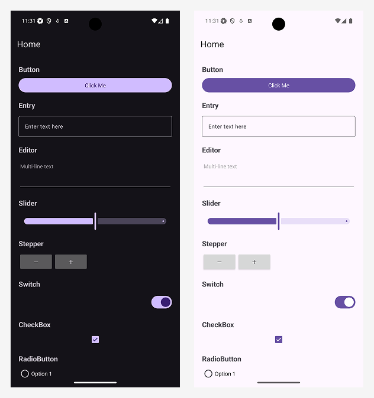

# What's new in .NET MAUI for .NET 11

The focus of .NET Multi-platform App UI (.NET MAUI) in .NET 11 is to improve product quality. For information about what's new in each .NET MAUI in .NET 11 release, see the following release notes:

- [.NET MAUI in .NET 11 Preview 1](https://github.com/dotnet/core/blob/main/release-notes/11.0/preview/preview1/dotnetmaui.md)
- [.NET MAUI in .NET 11 Preview 2](https://github.com/dotnet/core/blob/main/release-notes/11.0/preview/preview2/dotnetmaui.md)
- [.NET MAUI in .NET 11 Preview 3](https://github.com/dotnet/core/blob/main/release-notes/11.0/preview/preview3/dotnetmaui.md)
- [.NET MAUI in .NET 11 Preview 4](https://github.com/dotnet/core/blob/main/release-notes/11.0/preview/preview4/dotnetmaui.md)
- [.NET MAUI in .NET 11 Preview 5](https://github.com/dotnet/core/blob/main/release-notes/11.0/preview/preview5/dotnetmaui.md)
- [.NET MAUI in .NET 11 Preview 6](https://github.com/dotnet/core/blob/main/release-notes/11.0/preview/preview6/dotnetmaui.md)
- [.NET MAUI in .NET 11 Preview 7](https://github.com/dotnet/core/blob/main/release-notes/11.0/preview/preview7/dotnetmaui.md)

> [!IMPORTANT]
> Due to working with external dependencies, such as Xcode or Android SDK Tools, the .NET MAUI support policy differs from the [.NET and .NET Core support policy](https://dotnet.microsoft.com/platform/support/policy/maui). For more information, see [.NET MAUI support policy](https://dotnet.microsoft.com/platform/support/policy/maui).

In .NET 11, .NET MAUI ships as a .NET workload and multiple NuGet packages. The advantage of this approach is that it enables you to easily pin your projects to specific versions, while also enabling you to easily preview unreleased or experimental builds.

## CoreCLR is the default runtime

Starting in .NET 11 Preview 4, CoreCLR is the default runtime on all .NET MAUI platforms for projects built with and targeting .NET 11. This unifies the runtime across .NET MAUI with benefits for debugging, profiling, Hot Reload, app size, and app performance. For a detailed overview of this transition, see the [announcement blog post](https://aka.ms/maui-coreclr).

## Testing

.NET 11 RC 1 adds test project templates for Android, iOS, tvOS, macOS, and Mac Catalyst. The template short names are `androidtest`, `iostest`, `tvostest`, `macostest`, and `maccatalysttest`. The test projects use Microsoft.Testing.Platform and run in an app process on a device, simulator, or desktop target with `dotnet test`.

```console
dotnet new androidtest -n MyTests
cd MyTests
dotnet test
```

For more information, see [Unit testing](~/deployment/unit-testing.md) and GitHub PRs [dotnet/android #10862](https://github.com/dotnet/android/pull/10862), [dotnet/android #11130](https://github.com/dotnet/android/pull/11130), [dotnet/macios #25195](https://github.com/dotnet/macios/pull/25195), [dotnet/macios #25320](https://github.com/dotnet/macios/pull/25320), and [dotnet/macios #25963](https://github.com/dotnet/macios/pull/25963).

## Controls

.NET MAUI in .NET 11 includes control enhancements and deprecations.

### HybridWebView JS-to-.NET invocation

Starting in .NET 11 Preview 6, <xref:Microsoft.Maui.Controls.HybridWebView> can use source-generated JSON metadata when JavaScript invokes .NET methods. Call `SetInvokeJavaScriptTarget<T>(T target, JsonSerializerContext jsonSerializerContext)` with a source-generated `JsonSerializerContext` to avoid reflection-based serialization, making JS-to-.NET invocation compatible with NativeAOT and full trimming. This overload depends on the HybridWebView source generator that's included with .NET MAUI; if analyzers are disabled or the direct call isn't intercepted, the overload throws. The legacy overload remains available, but is annotated as requiring unreferenced code and dynamic code. For more information, see [GitHub PR #35626](https://github.com/dotnet/maui/pull/35626).

### Material 3 on Android

In .NET 11 Preview 4, the Android handlers for several core controls use Material 3 styling and behaviors out of the box, bringing them in line with modern Android design and unlocking the Material 3 theming system:

- <xref:Microsoft.Maui.Controls.ImageButton> — see [GitHub PR #33649](https://github.com/dotnet/maui/pull/33649).
- <xref:Microsoft.Maui.Controls.DatePicker> — see [GitHub PR #33651](https://github.com/dotnet/maui/pull/33651).
- <xref:Microsoft.Maui.Controls.Entry> — see [GitHub PR #33673](https://github.com/dotnet/maui/pull/33673).
- <xref:Microsoft.Maui.Controls.Slider> — see [GitHub PR #33603](https://github.com/dotnet/maui/pull/33603).



In .NET 11 Preview 5, the underlying Material 3 helper types (`MauiMaterialEditText`, `MauiMaterialDatePicker`, `MauiMaterialPicker`, `MauiMaterialTimePicker`, `MauiMaterialTextView`, `MauiMaterialSearchBarTextInputLayout`, `MaterialActivityIndicator`, and `MauiMaterialContextThemeWrapper`) are public so you can subclass them from your own handler customizations. For more information, see [GitHub PR #35323](https://github.com/dotnet/maui/pull/35323) and [Material 3](~/user-interface/material-design.md).

### BoxView Fill property

:::moniker range=">=net-maui-11.0"

<xref:Microsoft.Maui.Controls.BoxView> now exposes a `Fill` bindable property of type <xref:Microsoft.Maui.Controls.Brush>, allowing it to be painted with any brush (including <xref:Microsoft.Maui.Controls.LinearGradientBrush> and <xref:Microsoft.Maui.Controls.RadialGradientBrush>) instead of just a solid color. When both `Fill` and `Color` are set, `Fill` takes priority; setting `Fill` back to `null` causes the <xref:Microsoft.Maui.Controls.BoxView> to render using `Color` again. For more information, see [Fill a BoxView with a brush](~/user-interface/controls/boxview.md#fill-a-boxview-with-a-brush) and [GitHub PR #31789](https://github.com/dotnet/maui/pull/31789).

```xaml
<BoxView Opacity="0.5"
         WidthRequest="200"
         HeightRequest="100"
         HorizontalOptions="Center"
         VerticalOptions="Center">
    <BoxView.Fill>
        <LinearGradientBrush StartPoint="0,0" EndPoint="1,0">
            <GradientStop Color="Purple" Offset="0.0" />
            <GradientStop Color="Orange" Offset="0.5" />
            <GradientStop Color="Red" Offset="1.0" />
        </LinearGradientBrush>
    </BoxView.Fill>
</BoxView>
```

:::image type="content" source="../user-interface/controls/media/boxview/boxview-linear-fill.png" alt-text="Screenshot of a BoxView painted with a linear gradient brush.":::

Or a <xref:Microsoft.Maui.Controls.RadialGradientBrush>:

```xaml
<BoxView Opacity="0.5"
         WidthRequest="200"
         HeightRequest="100"
         HorizontalOptions="Center"
         VerticalOptions="Center">
    <BoxView.Fill>
        <RadialGradientBrush Center="0.5,0.5" Radius="0.5">
            <GradientStop Color="Yellow" Offset="0.0" />
            <GradientStop Color="Green" Offset="1.0" />
        </RadialGradientBrush>
    </BoxView.Fill>
</BoxView>
```

:::image type="content" source="../user-interface/controls/media/boxview/boxview-radial-fill.png" alt-text="Screenshot of a BoxView painted with a radial gradient brush.":::

:::moniker-end

### LongPressGestureRecognizer

.NET 11 adds a built-in <xref:Microsoft.Maui.Controls.LongPressGestureRecognizer> for handling long-press gestures. It supports a configurable press duration, a movement threshold to cancel the gesture if the user's finger moves too far, state tracking via `GestureState`, and command binding with `Command` and `CommandParameter`. For more information, see [GitHub PR #33432](https://github.com/dotnet/maui/pull/33432).

```xaml
<Image Source="dotnet_bot.png">
    <Image.GestureRecognizers>
        <LongPressGestureRecognizer Duration="500"
                                    LongPressed="OnLongPressed" />
    </Image.GestureRecognizers>
</Image>
```

```csharp
void OnLongPressed(object sender, LongPressGestureRecognizerEventArgs e)
{
    if (e.State == GestureState.Completed)
    {
        // Handle completed long press
    }
}
```

### Map

The <xref:Microsoft.Maui.Controls.Maps.Map> control receives a significant set of enhancements in .NET 11 Preview 3:

#### Pin clustering

Enable pin clustering to group nearby pins at lower zoom levels. Set `IsClusteringEnabled` on the map and optionally assign a `ClusteringIdentifier` to each pin. Handle the `ClusterClicked` event to respond when a user taps a cluster.

```xaml
<maps:Map IsClusteringEnabled="True"
          ClusterClicked="OnClusterClicked" />
```

#### Custom pin icons

Pins can now display a custom image instead of the default marker by setting the `ImageSource` property:

```csharp
var pin = new Pin
{
    Label = "Custom pin",
    Location = new Location(47.6062, -122.3321),
    ImageSource = ImageSource.FromFile("custom_pin.png")
};
```

#### Custom JSON map styling (Android)

Apply a custom JSON style to the map on Android using the `MapStyle` property. This enables dark mode maps, hiding labels, or any styling supported by the Google Maps Styling API.

#### Map events and element properties

- `MapLongClicked` — fires when the user long-presses on the map.
- `Circle`, `Polygon`, and `Polyline` now raise click events (`MapElementClick`).
- `MapElement.IsVisible` and `MapElement.ZIndex` — control element visibility and draw order.
- `Pin.ShowInfoWindow()` / `Pin.HideInfoWindow()` — programmatically show or hide a pin's info window.
- `UserLocationChanged` event and `LastUserLocation` property — track the user's location in real time.

#### Animated MoveToRegion and MapSpan.FromLocations

`MoveToRegion` now supports animated transitions, and the new `MapSpan.FromLocations()` factory method creates a span that encompasses a collection of locations.

For more information, see GitHub PRs [#29101](https://github.com/dotnet/maui/pull/29101), [#33831](https://github.com/dotnet/maui/pull/33831), [#33950](https://github.com/dotnet/maui/pull/33950), [#33982](https://github.com/dotnet/maui/pull/33982), [#33985](https://github.com/dotnet/maui/pull/33985), [#33792](https://github.com/dotnet/maui/pull/33792), [#33799](https://github.com/dotnet/maui/pull/33799), [#33991](https://github.com/dotnet/maui/pull/33991), and [#33993](https://github.com/dotnet/maui/pull/33993).

In .NET 11 Preview 5, the <xref:Microsoft.Maui.Controls.Maps.Map> control gains a Windows implementation backed by Azure Maps. To use it, call `UseMapServiceToken(...)` in `MauiProgram.cs` with an Azure Maps subscription key. The Windows implementation supports `MoveToRegion`, map types, traffic, scrolling, zooming, and standard pins; some platform-only features such as user location, custom pin info windows, and map elements/shapes aren't supported on Windows. For more information, see [GitHub PR #34138](https://github.com/dotnet/maui/pull/34138).

### BoxView Fill

Starting in .NET 11 Preview 5, <xref:Microsoft.Maui.Controls.BoxView> exposes a `Fill` property of type <xref:Microsoft.Maui.Controls.Brush>. This aligns <xref:Microsoft.Maui.Controls.BoxView> with the other shape primitives and means gradients and other brushes can paint a `BoxView` without a custom handler. `BackgroundColor` still works as before. For more information, see [GitHub PR #31789](https://github.com/dotnet/maui/pull/31789).

```xaml
<BoxView HeightRequest="120" CornerRadius="12">
    <BoxView.Fill>
        <LinearGradientBrush StartPoint="0,0" EndPoint="1,1">
            <GradientStop Color="#512BD4" Offset="0.0" />
            <GradientStop Color="#0099CC" Offset="1.0" />
        </LinearGradientBrush>
    </BoxView.Fill>
</BoxView>
```

### Windows CollectionView2 handler

Starting in .NET 11 Preview 6, Windows uses the CollectionView2 handler by default for <xref:Microsoft.Maui.Controls.CollectionView>. If you need to temporarily use the previous Windows handler while validating an app, set `UseWindowsCollectionView2Handler` to `false` in your project file. For more information, see [GitHub PR #34600](https://github.com/dotnet/maui/pull/34600).

```xml
<PropertyGroup>
  <UseWindowsCollectionView2Handler>false</UseWindowsCollectionView2Handler>
</PropertyGroup>
```

### Android Shell handler

Starting in .NET 11 Preview 6, Android <xref:Microsoft.Maui.Controls.Shell> apps use the handler-based Shell architecture by default. The new architecture reuses the same handler building blocks as other .NET MAUI navigation features, while the legacy `ShellRenderer` path remains available if you explicitly register it. For more information, see [GitHub PR #34758](https://github.com/dotnet/maui/pull/34758).

### Compatibility package removal

Starting in .NET 11 Preview 6, the optional `Microsoft.Maui.Controls.Compatibility` NuGet package is no longer built or shipped. Projects that explicitly referenced this package for Xamarin.Forms migration compatibility should migrate off it before moving to .NET 11. Apps that only reference `Microsoft.Maui.Controls` aren't affected. For more information, see [GitHub PR #35870](https://github.com/dotnet/maui/pull/35870).

### iOS and Mac Catalyst NavigationPage and TabbedPage handlers

Starting in .NET 11 Preview 7, <xref:Microsoft.Maui.Controls.NavigationPage> and <xref:Microsoft.Maui.Controls.TabbedPage> use `NavigationViewHandler` and `TabbedViewHandler` by default on iOS and Mac Catalyst, rather than the `NavigationRenderer` and `TabbedRenderer` compatibility renderers. This aligns Apple platforms with Android, Windows, and Tizen, which already used handlers. Neither change is gated behind a feature switch, so apps that use custom renderers or extensive navigation customizations should test against this preview. Both renderers remain available in the compatibility layer as a manual fallback.

For <xref:Microsoft.Maui.Controls.NavigationPage>, the handler also aligns iOS and Mac Catalyst event timing with the other platforms. The `Appearing` event now occurs before the page is pushed, rather than after the page becomes visible, and pushing a page that was previously popped creates a new view controller instead of reusing the previous one. Use the `NavigatedTo` event rather than `Appearing` for work that assumes the page is on screen. <xref:Microsoft.Maui.Controls.ToolbarItem> objects whose `Order` property is `Secondary` also move into an overflow menu in the navigation bar, rather than a toolbar at the bottom of the page. For more information, see [NavigationPage on iOS and Mac Catalyst](~/user-interface/pages/navigationpage.md#navigationpage-on-ios-and-mac-catalyst), [Migrate iOS NavigationPage renderers](~/migration/custom-renderers.md#migrate-ios-navigationpage-renderers), and [GitHub PR #36109](https://github.com/dotnet/maui/pull/36109).

For <xref:Microsoft.Maui.Controls.TabbedPage>, existing functionality is preserved, including tab titles, icons, and selection, the bar and tab color properties, the **More** tab, and the `TranslucencyMode` platform-specific. For more information, see [TabbedPage on iOS and Mac Catalyst](~/user-interface/pages/tabbedpage.md#tabbedpage-on-ios-and-mac-catalyst), [Migrate iOS TabbedPage renderers](~/migration/custom-renderers.md#migrate-ios-tabbedpage-renderers), and [GitHub PR #36507](https://github.com/dotnet/maui/pull/36507).

### TabbedPage badges

In .NET 11 RC 1, <xref:Microsoft.Maui.Controls.TabbedPage> children can show a badge. Use the `TabbedPage.BadgeText`, `TabbedPage.BadgeColor`, and `TabbedPage.BadgeTextColor` attached properties to set the text and colors:

```xaml
<ContentPage Title="Inbox"
             TabbedPage.BadgeText="3"
             TabbedPage.BadgeColor="Red"
             TabbedPage.BadgeTextColor="White" />
```

Android, iOS, Mac Catalyst, and Windows support initial values and runtime updates. On iOS and Mac Catalyst 18 or later, UIKit might use system badge colors instead of the custom colors. For more information, see [TabbedPage](~/user-interface/pages/tabbedpage.md) and [GitHub PR #37755](https://github.com/dotnet/maui/pull/37755).

### SwipeItem colors

In .NET 11 RC 1, <xref:Microsoft.Maui.Controls.SwipeItem> adds `IconColor` and `TextColor` properties. Both properties support `AppThemeBinding`:

```xaml
<SwipeItem Text="Delete"
           IconImageSource="delete.svg"
           BackgroundColor="{AppThemeBinding Light=White, Dark=Black}"
           IconColor="{AppThemeBinding Light=Black, Dark=White}"
           TextColor="{AppThemeBinding Light=Black, Dark=White}" />
```

If you don't set `IconColor`, non-font images now keep their original colors. In .NET 10, .NET MAUI automatically changed these images to white or black to contrast with `BackgroundColor`. Set `IconColor` if your app depends on the previous tint. For more information, see [SwipeView](~/user-interface/controls/swipeview.md) and [GitHub PR #36884](https://github.com/dotnet/maui/pull/36884).

### BlazorWebView static content caching

In .NET 11 RC 1, <xref:Microsoft.AspNetCore.Components.WebView.Maui.BlazorWebView> can cache local static content. Set `StaticContentCacheControlProvider` to return a cache control value for the content that you want to cache:

```csharp
blazorWebView.StaticContentCacheControlProvider = request =>
    request.ContentType.StartsWith("image/", StringComparison.Ordinal)
        ? "public, max-age=86400"
        : null;
```

A `null`, empty, or whitespace return value keeps the existing `no-store` behavior. .NET MAUI uses a bounded cache for each web view and doesn't cache authenticated, range, non-`GET`, or `no-store` requests. For more information, see [BlazorWebView](~/user-interface/controls/blazorwebview.md) and [GitHub PR #35706](https://github.com/dotnet/maui/pull/35706).

### iOS and Mac Catalyst FlyoutPage handler

In .NET 11 RC 1, <xref:Microsoft.Maui.Controls.FlyoutPage> uses `FlyoutViewHandler` by default on iOS and Mac Catalyst. Apps that use a custom `PhoneFlyoutPageRenderer` must register the renderer explicitly. For more information, see [FlyoutPage](~/user-interface/pages/flyoutpage.md) and [GitHub PR #36676](https://github.com/dotnet/maui/pull/36676).

## Navigation

### Shell route templates

Starting in .NET 11 Preview 7, a route that's registered with the `Routing.RegisterRoute` method can include *path parameters*, inspired by ASP.NET Core and Blazor routing. A route that contains one or more path parameters is known as a *route template*, and captured values are delivered to the destination page through the existing `QueryProperty` and `IQueryAttributable` mechanisms, without encoding every value as a query string.

```csharp
Routing.RegisterRoute("trip/{tripId}", typeof(TripDetailPage));
await Shell.Current.GoToAsync("//routes/trip/SEA-204");
```

Templates support required, optional, defaulted, constrained, catch-all, and mixed segments. Route templates are additive, so routes that don't contain a path parameter are unaffected. Route templates currently require absolute navigation. For more information, see [Route templates](~/fundamentals/shell/navigation.md#route-templates), the [Shell route templates sample](/samples/dotnet/maui-samples/navigation-shell-route-templates), and [GitHub PR #35110](https://github.com/dotnet/maui/pull/35110).

## Animation

### Cancel animations with CancellationToken

Starting in .NET 11 Preview 5, the `ViewExtensions` animation methods (`FadeToAsync`, `RotateToAsync`, `ScaleToAsync`, `TranslateToAsync`, and the relative variants) accept an optional <xref:System.Threading.CancellationToken>. Passing a token lets you cancel a specific awaited animation without calling `CancelAnimations`, which cancels every animation on the element. The non-`Async` variants (`FadeTo`, `RotateTo`, and so on) are now marked `[Obsolete]` in favor of the `Async`-suffixed equivalents. For more information, see [GitHub PR #33372](https://github.com/dotnet/maui/pull/33372) and [Basic animation](~/user-interface/animation/basic.md#canceling-animations).

## Accessibility

### Windows layout automation peers

Starting in .NET 11 Preview 6, Windows layout panels create `MauiLayoutAutomationPeer` instances and participate in UI Automation when they expose automation information, such as `AutomationId`, `AutomationProperties.IsInAccessibleTree`, `SemanticProperties.Description`, or `SemanticProperties.Hint`. This keeps purely structural layouts out of the screen reader tree while making intentionally accessible layouts discoverable. For more information, see [GitHub PR #35597](https://github.com/dotnet/maui/pull/35597).

### Back button accessibility label

Starting in .NET 11 Preview 5, you can set the accessibility label that screen readers (TalkBack, VoiceOver, Narrator) announce for the toolbar back button. <xref:Microsoft.Maui.Controls.NavigationPage> defines a `BackButtonAccessibilityLabel` attached property, and <xref:Microsoft.Maui.Controls.BackButtonBehavior> defines an `AccessibilityLabel` property for Shell apps. Both are independent of the visible back-button title, so you can keep the visible label short and still expose a descriptive spoken label. For more information, see [GitHub PR #35011](https://github.com/dotnet/maui/pull/35011), [NavigationPage](~/user-interface/pages/navigationpage.md), and [Back button behavior](~/fundamentals/shell/navigation.md#back-button-behavior).

## Platform features

.NET MAUI's platform features have received some updates in .NET 11.

### Passkeys

Starting in .NET 11 Preview 7, the `Passkeys` class in the `Microsoft.Maui.Authentication` namespace drives the native [WebAuthn/FIDO2](https://www.w3.org/TR/webauthn-3/) ceremony through the platform authenticator, such as Face ID, Touch ID, Windows Hello, or an Android biometric prompt. Check `Passkeys.IsSupported`, then call `Passkeys.CreateAsync` to register a credential, or `Passkeys.AssertAsync` to sign in with an existing credential. The contract is standard WebAuthn options JSON in and standard WebAuthn response JSON out, so it interoperates with existing relying party server libraries, including the passkey support in ASP.NET Core Identity.

Passkeys are supported on Android 14 (API 34), iOS 16, Mac Catalyst 16, and Windows 10 version 1903 or later. The .NET 11 toolchain's minimum Mac Catalyst deployment target is 17, which is the effective floor for .NET 11 apps. The client performs no verification of its own. Challenge generation, and relying party ID, origin, attestation, and assertion validation, remain the responsibility of your server. Successful registration also requires platform trust configuration, such as Digital Asset Links on Android and Associated Domains on Apple platforms. For more information, see [Passkeys](~/platform-integration/communication/passkeys.md), the [Passkeys sample](/samples/dotnet/maui-samples/platformintegration-passkeys), and [GitHub PR #36837](https://github.com/dotnet/maui/pull/36837).

### Save captured media to the gallery

Starting in .NET 11 Preview 7, the `MediaPickerOptions.SaveToGallery` property saves a captured photo or video to the device's gallery. The property defaults to `false`, and applies only to the <xref:Microsoft.Maui.Media.IMediaPicker.CapturePhotoAsync%2A> and <xref:Microsoft.Maui.Media.IMediaPicker.CaptureVideoAsync%2A> methods. It's supported on Android, iOS, and Mac Catalyst, and is ignored on Windows and Tizen. For more information, see [Save captured media to the gallery](~/platform-integration/device-media/picker.md#save-captured-media-to-the-gallery) and [GitHub PR #34641](https://github.com/dotnet/maui/pull/34641).

### Status bar theme

Starting in .NET 11 Preview 7, the `Window.StatusBarTheme` property controls the appearance of the operating system-drawn status bar icons on Android 6.0 (API 23) or later, and iOS, independently of the app theme. This is useful when edge-to-edge content places a light or dark surface behind the status bar. `StatusBarTheme.Light` indicates a light surface and displays dark icons, `StatusBarTheme.Dark` indicates a dark surface and displays light icons, and the default value of `StatusBarTheme.Default` follows the current app theme. For more information, see [Set the status bar theme](~/user-interface/controls/window.md#set-the-status-bar-theme) and [GitHub PR #34903](https://github.com/dotnet/maui/pull/34903).

### Android system bars can use .NET MAUI chrome colors

In .NET 11 RC 1, Android apps can use the effective colors of `NavigationPage`, Shell, `TabbedPage`, and modal chrome for the status bar and navigation bar backgrounds. Set the `MauiAndroidSystemBarsUseMauiChrome` project property to `true` to enable this behavior:

```xml
<PropertyGroup>
  <MauiAndroidSystemBarsUseMauiChrome>true</MauiAndroidSystemBarsUseMauiChrome>
</PropertyGroup>
```

The default value is `false`. This option changes the system bar backgrounds, but it doesn't change the system bar icon appearance. For more information, see [Window](~/user-interface/controls/window.md) and [GitHub PR #35463](https://github.com/dotnet/maui/pull/35463).

### Windows AppInstance activation

Starting in .NET 11 Preview 7, Windows apps can handle `AppInstance` activations with the `OnAppInstanceActivated` lifecycle hook, which receives the initial activation as well as subsequent file, protocol, and redirected activations. Combined with `AppInstance.FindOrRegisterForKey`, this lets you make your app single-instanced by redirecting activations from other instances to the running instance, which also enables <xref:Microsoft.Maui.Authentication.WebAuthenticator> callbacks in single-instance apps. For more information, see [Handle AppInstance activation](~/fundamentals/app-lifecycle.md#handle-appinstance-activation) and [GitHub PR #36640](https://github.com/dotnet/maui/pull/36640).

### Android MediaPicker result recovery

Starting in .NET 11 Preview 6, Android <xref:Microsoft.Maui.Media.MediaPicker> operations can recover results after the system picker or camera recreates the app process. Use `GetRecoveredMediaPickerResultsAsync`, `WaitForRecoveredMediaPickerResultsAsync`, `ClearRecoveredMediaPickerResultAsync`, and `DiscardPendingMediaPickerOperationAsync` to inspect, wait for, clear, or discard recovered results. Apps should persist their own workflow state before starting a picker or capture operation so recovered media can be matched to the right user action. For more information, see [GitHub PR #35455](https://github.com/dotnet/maui/pull/35455).

### Geolocation updates

Starting in .NET 11 Preview 6, `GeolocationListeningRequest.MinimumDistance` lets continuous location listeners filter updates by movement distance. On Android API 34 and later, geolocation results prefer mean sea level (MSL) altitude when available, report `AltitudeReferenceSystem.Geoid`, and use the matching MSL vertical accuracy. For more information, see [GitHub PR #35784](https://github.com/dotnet/maui/pull/35784) and [GitHub PR #35097](https://github.com/dotnet/maui/pull/35097).

### MonochromeFile for Android adaptive icons

Starting in .NET 11 Preview 4, single-project app icons can declare a dedicated monochrome layer for Android themed icons via a new `MonochromeFile` attribute on `MauiIcon`. This lets your themed icon use a different glyph than the foreground layer, instead of being a tinted reuse of it. For more information, see [GitHub PR #34569](https://github.com/dotnet/maui/pull/34569).

### Themed splash screens

In .NET 11 RC 1, `MauiSplashScreen` supports separate images, colors, and tint colors for dark mode:

```xml
<MauiSplashScreen Include="Resources\Splash\splash.svg"
                  Color="#FFFFFF"
                  DarkFile="Resources\Splash\splash-dark.svg"
                  DarkColor="#000000"
                  DarkTintColor="#FFFFFF"
                  BaseSize="128,128" />
```

Android generates `night`-qualified resources. iOS, iPadOS, and Mac Catalyst generate asset catalog launch resources when the minimum supported OS version is 14 or later. Projects that don't use the dark-mode metadata keep the existing splash screen behavior. For more information, see [Add a splash screen](~/user-interface/images/splashscreen.md) and [GitHub PR #35710](https://github.com/dotnet/maui/pull/35710).

### Image resize quality

In .NET 11 RC 1, the `ResizeQuality` metadata controls image sampling during Resizetizer build tasks. `Auto` keeps the existing default. `Best` uses higher-quality sampling, and `Fastest` uses nearest-neighbor sampling without mipmaps:

```xml
<MauiImage Include="Resources\Images\photo.png" ResizeQuality="Best" />
<MauiImage Include="Resources\Images\pixel-art.png"
           ResizeQuality="Fastest" />
```

The setting applies to raster and SVG images, app icons, and splash screen assets. For more information, see [Add images](~/user-interface/images/images.md) and [GitHub PR #34559](https://github.com/dotnet/maui/pull/34559).

### iOS PostNotifications permission

`Permissions.PostNotifications` is now implemented on iOS, providing a cross-platform API for requesting notification authorization. Previously this permission was only functional on Android. Use it to request authorization before scheduling local notifications on iOS. For more information, see [GitHub PR #30132](https://github.com/dotnet/maui/pull/30132).

```csharp
var status = await Permissions.RequestAsync<Permissions.PostNotifications>();
if (status == PermissionStatus.Granted)
{
    // Schedule notifications
}
```

Starting in .NET 11 Preview 6, the permissions API also exposes an `IPermissions` abstraction through `Permissions.Current`, which improves testability and extensibility for code that wraps permission checks. For more information, see [GitHub PR #35987](https://github.com/dotnet/maui/pull/35987).

### Trimmable CSS

.NET MAUI CSS support is now fully trimmable. If your app doesn't use CSS stylesheets, the CSS infrastructure is trimmed away during publish, reducing app size. No code changes are needed — the linker removes unused CSS types automatically. For more information, see [GitHub PR #33160](https://github.com/dotnet/maui/pull/33160).

## Visual State Manager

### InvalidateStyle and InvalidateVisualStates

Two new APIs make it easier to reapply styles and visual states that have been mutated in place:

- `VisualElement.InvalidateStyle()` — forces a control to reapply its current <xref:Microsoft.Maui.Controls.Style>, picking up any property changes made directly on the style object.
- `VisualStateManager.InvalidateVisualStates(VisualElement)` — reapplies the current visual state group setters, useful when visual state property values change at runtime.

These methods are especially useful for Hot Reload scenarios and dynamic UI updates where styles or visual states are modified without replacing the entire style object. For more information, see [GitHub PR #34723](https://github.com/dotnet/maui/pull/34723).

```csharp
// Mutate a style in place and force the control to pick up the change
var style = myButton.Style;
style.Setters.Add(new Setter { Property = Button.BackgroundColorProperty, Value = Colors.Red });
myButton.InvalidateStyle();

// Reapply visual states after changing a setter value
VisualStateManager.InvalidateVisualStates(myButton);
```

## XAML

### `x:Code` directive for inline C# in XAML

Starting in .NET 11 Preview 4, the XAML source generator supports an `x:Code` directive that lets you inline a small block of C# directly inside a XAML file. This makes it easier to keep view-local glue code next to the markup it serves without creating a code-behind partial just for a single helper. The `EnablePreviewFeatures` flag is required for this. For more information, see [GitHub PR #34715](https://github.com/dotnet/maui/pull/34715).

```xaml
<ContentPage xmlns="http://schemas.microsoft.com/dotnet/2021/maui"
             xmlns:x="http://schemas.microsoft.com/winfx/2009/xaml"
             x:Class="MyApp.MainPage">
    <x:Code><![CDATA[
        void OnButtonClicked(object sender, EventArgs e)
        {
            // inline C# method
        }
    ]]></x:Code>
    <Button Clicked="OnButtonClicked" Text="Click me" />
</ContentPage>
```

### Compiled bindings inside DataTemplates

Starting in .NET 11 Preview 4, compiled bindings with explicit sources defined inside a <xref:Microsoft.Maui.Controls.DataTemplate> now resolve correctly, fixing a regression that broke <xref:Microsoft.Maui.Controls.TapGestureRecognizer> bindings inside <xref:Microsoft.Maui.Controls.CollectionView> items in .NET 10. For more information, see [GitHub PR #34447](https://github.com/dotnet/maui/pull/34447).

The XAML source generator now also:

- Emits diagnostics when an `x:DataType` or binding is invalid. For more information, see [GitHub PR #34078](https://github.com/dotnet/maui/pull/34078).
- Correctly distinguishes static extension classes from `enum` types when resolving XAML markup. For more information, see [GitHub PR #34446](https://github.com/dotnet/maui/pull/34446).

### Implicit XAML namespace declarations

Starting in .NET 11, implicit XAML namespace declarations are enabled by default. XAML files no longer need the standard `xmlns` and `xmlns:x` declarations at the root element — the compiler injects them automatically. Existing explicit declarations still compile and can be used to disambiguate duplicate type names. For more information, see [GitHub PR #33834](https://github.com/dotnet/maui/pull/33834).

### Lazy ResourceDictionary

XAML Source Generation now registers resource dictionary entries as factories, inflating each resource on demand instead of eagerly loading everything at startup. This can yield up to an ~8× improvement in resource dictionary initialization time for apps with large dictionaries. The optimization is automatic when XAML source generation is enabled — no code changes are required. For more information, see [GitHub PR #33826](https://github.com/dotnet/maui/pull/33826).

### XAML Incremental Hot Reload

Starting in .NET 11 Preview 7, .NET MAUI includes a XAML Incremental Hot Reload engine. It uses a source generator and a `MetadataUpdateHandler` to generate patches for edits to existing `x:Class`-backed XAML pages and controls, and applies them to every live instance of the affected type. Therefore, pages that have already been instantiated can be updated without being recreated or navigated to again. Supported edits include changing properties and bindings, editing resources declared in a page or control, and adding, removing, or reordering child elements.

The engine is enabled by default for `Debug` builds, and is disabled by default for `Release` and publish builds. Because it applies updates through a `MetadataUpdateHandler`, XAML edits are applied by .NET Hot Reload hosts, including `dotnet watch`. For more information, see [`dotnet watch` for Android](#dotnet-watch-for-android) and [`dotnet watch` for iOS](#dotnet-watch-for-ios).

In .NET 11 RC 1, application resource changes update existing and new `DynamicResource` consumers. If you change a literal value or binding to a `DynamicResource`, the engine also removes the old local state so that later resource changes continue to update the property. For more information, see GitHub PRs [#37896](https://github.com/dotnet/maui/pull/37896) and [#37898](https://github.com/dotnet/maui/pull/37898).

Structural updates now reconcile original `x:Name` fields and namescope entries with the new visual tree. Property changes in a direct `CollectionView.ItemTemplate` also update realized cells without replacing the template or resetting selection, focus, or scroll position. For more information, see GitHub PRs [#37897](https://github.com/dotnet/maui/pull/37897) and [#37899](https://github.com/dotnet/maui/pull/37899).

To opt out and continue to use the existing XAML Hot Reload engine, set the `EnableMauiIncrementalHotReload` MSBuild property to `false`:

```xml
<PropertyGroup>
    <EnableMauiIncrementalHotReload>false</EnableMauiIncrementalHotReload>
</PropertyGroup>
```

For more information, see [Enable XAML Incremental Hot Reload](~/xaml/hot-reload.md#enable-xaml-incremental-hot-reload) and GitHub PRs [#34338](https://github.com/dotnet/maui/pull/34338) and [#37163](https://github.com/dotnet/maui/pull/37163).

### AOT-safe compiled RelativeSource bindings

Starting in .NET 11 Preview 7, the XAML source generator compiles a binding that uses [`RelativeSource`](xref:Microsoft.Maui.Controls.Xaml.RelativeSourceExtension) with a resolvable `AncestorType` into a trim-safe compiled binding, rather than a string-based binding path that relies on reflection and could lose bound members during trimming in NativeAOT and full-trimming builds.

```xaml
<Button Command="{Binding Source={RelativeSource AncestorType={x:Type local:PeopleViewModel}},
                          Path=DeleteEmployeeCommand}" />
```

`RelativeSource` bindings that use `Self` or `TemplatedParent` continue to use the runtime binding path. For an `x:Reference` binding, the source generator resolves the referenced element's type and compiles against it, and falls back to the runtime binding path only when the binding path can't be compiled against that resolved type. An `x:Reference` name that can't be resolved in a name scope, like an `AncestorType` that can't be resolved, causes XAML compilation to fail. For more information, see [Compile relative source ancestor bindings](~/fundamentals/data-binding/compiled-bindings.md#compile-relative-source-ancestor-bindings) and GitHub PRs [#34408](https://github.com/dotnet/maui/pull/34408) and [#36905](https://github.com/dotnet/maui/pull/36905).

## .NET for Android

.NET for Android in .NET 11 makes CoreCLR the default runtime for `Release` builds, and includes work to improve performance. For more information about .NET for Android in .NET 11, see the following release notes:

- [.NET for Android 11 Preview 1](https://github.com/dotnet/android/releases/)
- [.NET for Android 11 Preview 3](https://github.com/dotnet/android/releases/)

### Minimum supported Android API

Starting in .NET 11 Preview 3, the minimum supported Android API level has been raised from 21 (Lollipop) to 24 (Nougat). This means that .NET MAUI apps in .NET 11 require Android 7.0 or higher.

If your project explicitly sets `$(SupportedOSPlatformVersion)` to a value lower than 24, you'll need to update it:

```xml
<PropertyGroup>
  <SupportedOSPlatformVersion Condition="$([MSBuild]::GetTargetPlatformIdentifier('$(TargetFramework)')) == 'android'">24</SupportedOSPlatformVersion>
</PropertyGroup>
```

For more information, see [Supported platforms](~/supported-platforms.md).

> [!NOTE]
> Android API levels 21, 22, and 23 are only supported when using the Mono runtime.

### Faster and more reliable Android builds

.NET 11 RC 1 reduces work in clean and incremental Android builds. In a Release CoreCLR .NET MAUI sample-content app using trimmable type maps, a managed source change improved from 68.32 seconds to 52.31 seconds, and a manifest change improved from 39.74 seconds to 10.97 seconds. Type map generation in a clean build improved from 3,204 milliseconds to 792 milliseconds. RC 1 also fixes stale JAR resources in incremental APK updates and prevents post-link processing from writing satellite assemblies to the shared NuGet package cache. For more information, see GitHub PRs [#12229](https://github.com/dotnet/android/pull/12229), [#12279](https://github.com/dotnet/android/pull/12279), and [#12463](https://github.com/dotnet/android/pull/12463).

### Smaller Android packages

The Android trimmer now removes unused methods from user-defined `IJavaObject` types. In the tested ARM64 .NET MAUI app, the package size decreased by 664,926 bytes without R8 and by 718,174 bytes with R8. For more information, see [GitHub PR #12272](https://github.com/dotnet/android/pull/12272).

### Faster Android apps

Release CoreCLR builds now include most methods from the app assembly in partial ReadyToRun compilation. In tests, this improved startup by 2.4 percent for the basic .NET MAUI template and by 4.5 percent for the sample-content template. The package size increased by 65,536 bytes and 266,240 bytes, respectively. For more information, see [GitHub PR #12248](https://github.com/dotnet/android/pull/12248).

You can use full ReadyToRun compilation to trade more package size for startup performance:

```xml
<PropertyGroup>
  <MauiEnableFullReadyToRun>true</MauiEnableFullReadyToRun>
</PropertyGroup>
```

Partial ReadyToRun compilation remains the default. For more information, see GitHub PRs [dotnet/maui #37094](https://github.com/dotnet/maui/pull/37094) and [dotnet/android #12299](https://github.com/dotnet/android/pull/12299).

A single-page Shell app also defers unused tab infrastructure. In a matched 80-launch test on a Pixel 5, mean cold-start time decreased by 35.95 milliseconds, or 3.26 percent. Cached virtual JNI invocations decreased from 221.4 nanoseconds to 180.7 nanoseconds, with no change to the tested APK size. The JNI change didn't produce a statistically clear cold-start change. For more information, see GitHub PRs [dotnet/maui #37321](https://github.com/dotnet/maui/pull/37321) and [dotnet/android #12377](https://github.com/dotnet/android/pull/12377).

### Android breaking changes

- `Java.Lang.Object.JavaFinalize()` is obsolete. Override `Dispose(bool)` or use a C# finalizer instead. For more information, see [GitHub PR #11424](https://github.com/dotnet/android/pull/11424).
- If an Android manifest has a partial `<uses-sdk>` element without `android:targetSdkVersion`, the build now writes the value from `$(TargetSdkVersion)`. Android previously used the minimum SDK as the target SDK in this case. Test behavior that Android gates by target SDK, or set `android:targetSdkVersion` explicitly. For more information, see [GitHub PR #12290](https://github.com/dotnet/android/pull/12290).

## CoreCLR by Default

CoreCLR is now the default runtime for `Release` builds. This should
improve compatibility with the rest of .NET as well as shorter startup
times, with a reasonable increase to application size.

We are always working to improve performance and app size, but please
file issues with stability or concerns by filing
[issues on GitHub](https://github.com/dotnet/android/issues).

## `dotnet run`

We have enhanced the .NET CLI with [Spectre.Console](https://spectreconsole.net/) to *prompt* when a selection is needed for `dotnet run`.

So, for multi-targeted projects like .NET MAUI, it will:

* Prompt for a `$(TargetFramework)`
* Prompt for a device, emulator, simulator if there are more than one.

Console output of your application should appear directly in the terminal, and Ctrl+C will terminate the application.

In .NET 11 RC 1, `dotnet run` wakes a sleeping Android device and dismisses a non-secure keyguard before it starts the activity. When you stop `dotnet run` with <kbd>Ctrl+C</kbd>, it waits for the Android `force-stop` operation to finish before the command exits. For more information, see GitHub PRs [dotnet/android #12322](https://github.com/dotnet/android/pull/12322) and [dotnet/android #12318](https://github.com/dotnet/android/pull/12318).


## `dotnet watch` for Android

Starting in .NET 11 Preview 4, `dotnet watch` works for Android devices and emulators. After selecting a target framework and device, `dotnet watch` deploys your app and applies Hot Reload changes as you edit — no manual rebuild required.


## `dotnet watch` for iOS

Starting in .NET 11 Preview 4, several long-standing issues have been fixed to make `dotnet watch` usable end-to-end on a `dotnet new maui` project running in the iOS Simulator:

- The Spectre.Console TFM picker no longer appears stuck because two readers were both calling `Console.ReadKey()`. Keys now flow through a single `PhysicalConsole.KeyPressed` event. For more information, see [dotnet/sdk #53675](https://github.com/dotnet/sdk/pull/53675).
- <kbd>Ctrl+C</kbd> and <kbd>Ctrl+R</kbd> no longer surface a spurious `WebSocketException`/`ObjectDisposedException` when the WebSocket transport tears down. For more information, see [dotnet/sdk #53648](https://github.com/dotnet/sdk/pull/53648).
- Hot Reload no longer deadlocks on iOS when `UIKitSynchronizationContext` is installed before the startup hook runs. For more information, see [dotnet/sdk #54023](https://github.com/dotnet/sdk/pull/54023).


> [!IMPORTANT]
> `dotnet watch` does not work for iOS projects unless `<MtouchLink>None</MtouchLink>` is set in the `.csproj` file. For more information, see [dotnet/macios #25295](https://github.com/dotnet/macios/issues/25295).
>
> Add the following to your project file:
>
> ```xml
> <PropertyGroup>
>   <MtouchLink>None</MtouchLink>
> </PropertyGroup>
> ```

## .NET for iOS

.NET 11 on iOS, tvOS, Mac Catalyst, and macOS supports the following platform versions:

- iOS: 18.2
- tvOS: 18.2
- Mac Catalyst: 18.2
- macOS: 15.2

For more information about .NET 11 on iOS, tvOS, Mac Catalyst, and macOS, see the following release notes:

- [.NET 11.0.1xx Preview 1](https://github.com/dotnet/macios/releases/)

For information about known issues, see [Known issues in .NET 11](https://github.com/dotnet/macios/wiki/Known-issues-in-.NET11).

### Xcode 26.4

Starting in .NET 11 Preview 4, Xcode 26.4 Stable is the supported Xcode version, with refreshed bindings across UIKit, AVFoundation, WebKit, Metal, Photos, PassKit, CarPlay, AuthenticationServices, and more. For more information, see [dotnet/macios #25005](https://github.com/dotnet/macios/pull/25005).

One Apple-side breaking change: `HMError.QuotaExceeded` was removed by Apple and is no longer available. For more information, see [dotnet/macios #25024](https://github.com/dotnet/macios/pull/25024).

### HTTP digest authentication

Starting in .NET 11 Preview 4, HTTP digest authentication is supported in <xref:Foundation.NSUrlSessionHandler>. For more information, see [dotnet/macios #25180](https://github.com/dotnet/macios/pull/25180).

### CoreCLR for Apple platforms

Starting in .NET 11 Preview 4, CoreCLR is the default runtime for .NET for iOS, Mac Catalyst, macOS, and tvOS. For more information, see [CoreCLR is the default runtime](#coreclr-is-the-default-runtime) and [dotnet/macios #25050](https://github.com/dotnet/macios/pull/25050).

Preview 4 also includes a broad reliability and packaging pass across `NSUrlSessionHandler`, MSBuild, the linker, and runtime internals. For the complete list of changes, see the [Preview 4 changelog](https://github.com/dotnet/macios/compare/release/11.0.1xx-preview3...release/11.0.1xx-preview4).

### Apple Intelligence APIs

Starting in .NET 11 Preview 5, the Apple Intelligence APIs are available from .NET for iOS, Mac Catalyst, macOS, and tvOS. These include the Foundation Models framework for on-device generative AI, Image Playground for system-provided image generation, Writing Tools entitlements, and the Translation framework. For more information, see [dotnet/macios #25457](https://github.com/dotnet/macios/pull/25457) and the [Preview 5 changelog](https://github.com/dotnet/macios/compare/release/11.0.1xx-preview4...release/11.0.1xx-preview5).

### NativeAOT registrar default

In .NET 11 RC 1, NativeAOT apps that target .NET 11 use the trimmable-static registrar and assembly preparation by default. Mono and CoreCLR keep their existing registrar defaults in this RC 1 release. For more information, see [dotnet/macios #26346](https://github.com/dotnet/macios/pull/26346).

### NativeAOT debug symbols

macOS and Mac Catalyst NativeAOT builds now generate dSYM files by default, even when `ArchiveOnBuild` isn't enabled. dSYM files from XCFrameworks are also copied next to the app dSYM for inclusion in archives. For more information, see GitHub PRs [dotnet/macios #26197](https://github.com/dotnet/macios/pull/26197) and [dotnet/macios #25979](https://github.com/dotnet/macios/pull/25979).

### Failable Objective-C initializers

Binding authors can combine `[FactoryMethod]` with `[return: NullAllowed]` to expose a failable Objective-C initializer as a nullable static factory method. For more information, see [dotnet/macios #26196](https://github.com/dotnet/macios/pull/26196).

### Bundled framework metadata stripping

Apple app builds now remove the `Headers`, `PrivateHeaders`, and `Modules` directories from bundled frameworks before code signing. Set `StripFrameworkHeaders` to `false` if your app needs these directories. For more information, see [dotnet/macios #26253](https://github.com/dotnet/macios/pull/26253).

## Breaking changes

### Color is sealed

In .NET 11 RC 1, the <xref:Microsoft.Maui.Graphics.Color> record is sealed. Code that derives from `Color` must use composition instead. For more information, see [GitHub PR #36443](https://github.com/dotnet/maui/pull/36443).

## See also

- [.NET MAUI roadmap](https://github.com/dotnet/maui/wiki/Roadmap)
- [What's new in .NET 11](/dotnet/core/whats-new/dotnet-11/overview)
